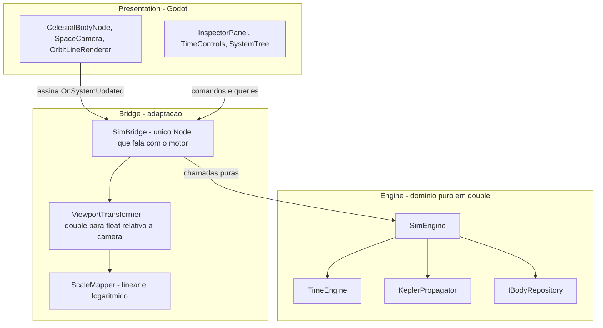
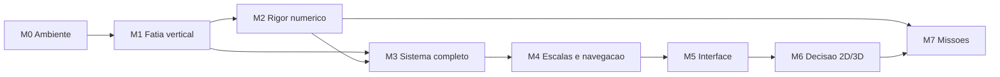

# Roadmap — Solar Sim (Godot + C#)

Plano de execução derivado da especificação de engenharia: solução analítica de Kepler
para o problema de dois corpos, sobre uma arquitetura em camadas com inversão de
dependência.

**Objetivo do produto:** não é um simulador fechado, e sim uma base sobre a qual construir
algo maior depois (missões espaciais, transferências orbitais). Isso muda o projeto do
motor: capacidades que num simulador puramente visual seriam luxo — vetor de estado,
conversão inversa de órbita, cônicas abertas — aqui são fundação.

**Estratégia:** fatia vertical primeiro. O marco M1 atravessa todas as camadas de forma
rasa e coloca a Terra girando na tela antes de qualquer camada estar completa. Só depois
cada camada é aprofundada. Isso valida a arquitetura cedo, quando corrigir ainda é barato.

**Legenda de status:** `[ ]` pendente · `[~]` em andamento · `[x]` concluído

---


## Invariantes arquiteturais

Estas quatro regras valem para todo o projeto e estão espelhadas em `.cursor/rules/`.
Violá-las não gera um bug imediato e visível — gera erosão silenciosa que só aparece
muitos marcos depois, quando o conserto já é caro.

1. **Nenhum arquivo em** `Engine/` **contém** `using Godot`**.** O motor deve compilar e ser
  testado sem o Godot sequer instalado. Essa é a definição operacional de domínio puro.
2. **Toda matemática do domínio em** `double`**.** A conversão para `float` acontece somente
  na camada Bridge, e somente *depois* de subtrair a posição da câmera. Converter antes
   é exatamente o que produz trepidação em objetos distantes da origem.
3. **Unidades internas: quilômetros, segundos, radianos.** Graus existem apenas na
  fronteira do JSON e no texto exibido ao usuário.
4. **O estado é função pura da Data Juliana.** Nada de integração acumulativa. É essa
  propriedade que entrega de graça o tempo reverso, o salto para uma data arbitrária e o
   save/load trivial: salvar o mundo inteiro é salvar um `double`.


### Convenção de unidades


| Grandeza                | Unidade              | Observação                            |
| ----------------------- | -------------------- | ------------------------------------- |
| Distância               | km                   |                                       |
| Tempo (física)          | segundos             |                                       |
| Tempo (calendário)      | Data Juliana em dias | Época J2000.0 = 2451545.0             |
| Ângulos                 | radianos             | Convertidos de graus na carga do JSON |
| Parâmetro gravitacional | km³/s²               | Mesma unidade em que o JPL publica GM |


A escolha de km e segundos alinha o projeto com a literatura de astrodinâmica e com as
tabelas do JPL, evitando uma camada de conversão no dia em que as transferências orbitais
entrarem. O custo é converter `Δt` de dias para segundos no propagador, o que é uma
multiplicação por 86400 em um único ponto do código.

---


## Arquitetura em camadas




### Por que a camada Bridge existe

O diagrama da especificação previa uma camada de adaptação, mas a estrutura inicial de
pastas tinha apenas `Engine/`, `Render/` e `UI/`. Sem um lugar próprio, duas
responsabilidades escorregam para dentro de `Render/`:

- a conversão `double` para `float` relativa à câmera, que é o único ponto onde a precisão
do sistema pode ser destruída;
- o mapeamento de escala linear e logarítmico.

Espalhadas por vários nós gráficos, essas duas regras acabam duplicadas e divergentes, e
a fronteira arquitetural vira apenas um comentário no README. Concentradas em `Bridge/`,
existem em um lugar só e podem ser testadas isoladamente.

`SimBridge` é o único nó do Godot que conhece o `SimEngine`. Todos os demais nós assinam
o evento de snapshot. Isso mantém o número de pontos de acoplamento entre os dois mundos
igual a um.

---


## Estado do ambiente

Instalado e verificado: **.NET SDK 10.0.302** e **Godot 4.7.1 (variante .NET)**. A solução
compila sem avisos e os testes rodam com o editor fechado.

Os projetos alvejam `net8.0` (motor e projeto Godot) e `net10.0` (testes). O Godot 4.7
exige no mínimo .NET 8, e a recomendação oficial é manter o SDK mais recente instalado
independentemente do alvo.

---


## M0 — Ambiente e esqueleto compilável

Objetivo: sair do zero absoluto para um projeto que compila, abre no Godot e roda testes.

- [x] .NET SDK 10.0.302 instalado e verificado com `dotnet --info`
- [x] Godot 4.7.1 na variante .NET (o pacote se chama `GodotEngine.GodotEngine.Mono`;
  ```
  o nome "Mono" é histórico e não indica o runtime antigo)
  ```
- [x] `solar-sim-godot.csproj` com `Godot.NET.Sdk/4.7.1`, `EnableDynamicLoading` e
  ```
  `Nullable`, excluindo `Engine/**` e `Tests/**` dos globs de compilação
  ```
- [x] `project.godot` com `config_version=5` e cena principal apontando para `Main.tscn`
- [x] Cenas mínimas válidas em `Scenes/`, sem as quais o projeto não abre
- [x] `Engine/SolarSim.Engine.csproj` como biblioteca separada
- [x] `Tests/SolarSim.Tests.csproj` (xUnit) referenciando apenas `Engine/`
- [x] `solar-sim-godot.sln` no formato clássico, agregando os três projetos
- [x] Teste-guardião do invariante 1 em `Tests/ArchitectureTests.cs`
- [x] `.gdignore` em `Engine/` e `Tests/`, para o Godot não tratá-los como pastas de script
- [x] Regras do projeto em `.cursor/rules/`, `AGENTS.md`, `.gitignore`, `.gitattributes`,
  ```
  `.editorconfig` e `README.md`
  ```


### Decisão: o motor é um projeto separado

Em vez de deixar `Engine/` dentro do projeto do Godot e confiar em disciplina, ele virou
uma biblioteca própria que não referencia o `GodotSharp`. O projeto do Godot e os testes
dependem dela por `ProjectReference`.

Com isso, o invariante 1 deixa de ser convenção e passa a ser garantido pelo compilador:
escrever `using Godot` em `Engine/` simplesmente não compila. O teste-guardião continua
existindo para pegar o caso em que alguém adiciona a referência ao `.csproj` do motor.

**Pronto quando:** `dotnet build` ~~passa, o Godot abre o projeto sem erro, e um teste
trivial roda com o editor fechado.~~ **Concluído:** build sem avisos, dois testes
passando, e `--headless --import` seguido de execução da cena principal com código de
saída 0.

---


## M1 — Fatia vertical: a Terra na tela

O marco mais importante do roadmap. Objetivo: o caminho mais curto que toca **todas** as
camadas, provando que a arquitetura funciona de ponta a ponta antes de investir em
profundidade. Tudo aqui é intencionalmente mínimo.

Corte mínimo por camada:

- [x] `Engine/Core/AstroConstants.cs` — J2000, GM do Sol e da Terra, UA, normalização
  ```
  de ângulo
  ```
- [x] `Engine/Models/Vector3D.cs` — `readonly record struct` com operadores, produto
  ```
  escalar e vetorial
  ```
- [x] `Engine/Models/OrbitalElements.cs` — os seis elementos, com fábrica que aceita UA
  ```
  e graus, que é como as tabelas de efemérides publicam
  ```
- [x] `Engine/Models/SystemStateSnapshot.cs` — `BodyState` e o snapshot publicado
- [x] `Engine/Core/TimeEngine.cs` — UTC para JD e de volta, acúmulo por delta e
  ```
  multiplicador, pausa, tempo reverso
  ```
- [x] `Engine/Core/KeplerPropagator.cs` — caso elíptico com Newton-Raphson e `atan2`
- [x] `Engine/Data/IBodyRepository.cs` + `HardcodedBodyRepository` com Sol e Terra
- [x] `Engine/SimEngine.cs` — lista plana, snapshot reaproveitado e evento
- [x] `Bridge/ScaleMapper.cs` — modo linear e regra provisória de raio visual
- [x] `Bridge/ViewportTransformer.cs` — subtração da câmera em `double`, conversão a `float`
- [x] `Bridge/SimBridge.cs` — `_Process` avança o tempo e publica `RenderFrame`
- [x] `Render/CelestialBodyNode.cs` e `Render/SpaceCamera.cs` — andaime 2D com zoom
- [x] `UI/TimeControls.cs` — pausa, velocidade e data por teclado
- [x] `Scenes/Main.tscn` com o `SimBridge` como raiz
- [x] 23 testes cobrindo tempo, propagador e orquestração

O repositório entra como interface já no M1, com implementação hardcoded, justamente para
adiar a discussão de schema do JSON até o M3 sem criar dívida: quando o
`JsonBodyRepository` chegar, ele entra pela mesma porta e nada acima precisa mudar.

### Desvios em relação ao plano original

- **Conversão JD para UTC entrou antecipada.** O plano deixava a inversa para depois, mas
sem ela não há como mostrar a data na tela, e a data é justamente como se confere que a
Terra completou uma volta.
- **A árvore de nós é montada em código, não em** `.tscn`**.** Como a decisão entre 2D e 3D só
aconteceria no M6, construir os nós em código evitava refazer arquivos de cena.
`Main.tscn` tem um nó só, com o `SimBridge`. A aposta se pagou: a migração para 3D no M6
não teve nenhuma cena para reconstruir, e o stub `Scenes/Prefabs/CelestialBody.tscn`, que
nunca chegou a ser usado, foi removido lá.
- `ImplicitUsings` **precisou ser ligado** no projeto do Godot; o `Godot.NET.Sdk` não o
habilita por padrão, ao contrário dos outros dois projetos.

**Pronto quando:** ~~a Terra descreve uma volta completa em torno do Sol na tela, com
play/pause funcionando e velocidade temporal ajustável.~~ **Concluído:** build sem avisos,
23 testes passando, e execução headless de 180 quadros com código de saída 0. A órbita é
verificada numericamente pelos testes de periélio/afélio e de retorno ao ponto de partida
após um período.

---


## M2 — Rigor numérico

Objetivo: transformar "parece certo" em "está comprovadamente certo". A partir daqui o
motor é confiável o suficiente para construir em cima.

- [x] Newton-Raphson com tolerância `1e-12`, teto de iterações e chute inicial adaptado
  ```
  para excentricidade alta (`E₀ = π` quando `e > 0.8`) — já entregue no M1
  ```
- [x] Normalizar a anomalia média para `[0, 2π)` antes de resolver — já no M1
- [x] Anomalia verdadeira por `atan2` — já no M1
- [x] Vetor velocidade, com `StateVector` preenchido (antecipado do M7)
- [x] Rotação completa `Rz(-Ω)·Rx(-i)·Rz(-ω)`, generalizada para aceitar qualquer vetor
  ```
  do plano orbital, e não apenas raio e anomalia
  ```
- [x] Marte acrescentado ao repositório, necessário para a comparação de referência
- [x] Contagem de iterações exposta pelo solver, para o critério ser verificado
- [x] `SimEngine.StateAt`, `ElementsOf` e `GravitationalParameterOf` para consulta de estado
- [x] Testes de invariantes: energia orbital específica, momento angular e a relação
  ```
  entre energia e semi-eixo maior
  ```
- [x] Regressão contra efemérides geométricas do JPL Horizons (solução DE441)


### Resultado da validação

Comparação com o JPL Horizons para o baricentro Terra-Lua e o de Marte, em 2000-01-01,
2013-01-01 e 2026-01-01, referencial eclíptico J2000 centrado no Sol:


| Grandeza                 | Erro máximo observado | Critério |
| ------------------------ | --------------------- | -------- |
| Distância radial         | 0,0132%               | 0,1%     |
| Direção do vetor posição | 0,0928°               | —        |
| Velocidade               | 0,0120%               | —        |


O erro cresce com a distância à época, como esperado de um modelo de elementos fixos: a
Terra sai de 0,0003% em J2000 para 0,0041% em 2026. O pior caso é sempre Marte em 2026.
Reduzir isso não é questão de ajustar o propagador, e sim de adotar taxas seculares nos
elementos, que é o primeiro item do backlog.

Os limites dos testes ficaram propositalmente próximos do erro medido (0,02% no raio,
0,15° na direção) para que sirvam de detector de regressão, em vez de apenas confirmar a
ordem de grandeza.

**Pronto quando:** ~~posições de Terra e Marte conferem com o JPL Horizons em três datas
distintas, com erro relativo abaixo de 0,1% na distância radial, e o solver converge em
menos de dez iterações para todo~~ `e < 0.95`~~.~~ **Concluído:** erro radial máximo de
0,0132%, sete vezes melhor que o critério. A convergência em menos de dez iterações é
verificada para `e` de 0 a 0,94, varrendo 720 valores de anomalia média em cada
excentricidade. 41 testes passando.

Os números acima são os medidos hoje. Eram 0,0133%, 0,0937° e 0,0121% no fechamento do
M2; a diferença veio do parâmetro gravitacional efetivo adotado no M3.

---


## M3 — Sistema completo e hierarquia

Objetivo: sair de dois corpos hardcoded para o Sistema Solar real, com luas.

- [x] Definir o schema de `Data/solar_system_j2000.json`, com unidades explícitas no
  ```
  próprio arquivo
  ```
- [x] Popular Sol, oito planetas, Lua, galileanas e Titã
- [x] `Engine/Data/DataLoader.cs` e `JsonBodyRepository` implementando `IBodyRepository`,
  ```
  convertendo graus para radianos na carga
  ```
- [x] Validação na carga: corpo pai inexistente, ciclo na hierarquia, `a <= 0`, campos
  ```
  ausentes — com mensagem de erro que diga qual corpo e qual campo
  ```
- [x] Ordem de avaliação garantindo pai antes de filho
- [x] Composição recursiva `P_global(A) = P_global(Pai(A)) + P_local(A)`
- [x] Remover a implementação hardcoded


### O schema

A unidade vive no nome do campo, e não em um cabeçalho distante: `radiusKm`,
`inclinationDeg`, `muKm3S2`. O semi-eixo aceita duas grafias, `semiMajorAxisAu` e
`semiMajorAxisKm`, porque as fontes usam escalas diferentes para planetas e satélites;
declarar as duas ao mesmo tempo é erro. O documento também traz `epoch`, conferido contra
J2000.0 na carga, e campos de documentação (`frame`, `sources`, `notes`, `note`) que o
motor lê e ignora — existem para quem abre o arquivo.

### Decisões e desvios

**O parâmetro gravitacional passou a ser o efetivo,** `mu(pai) + mu(corpo)`**.** É a forma
correta da equação do movimento relativo de dois corpos. Para um planeta em torno do Sol a
correção é imperceptível; para a Lua vale 1,2% e é a diferença entre um mês sideral de
27,45 e um de 27,32 dias. O efeito colateral foi melhorar de leve os números do M2.

**A hierarquia virou um objeto próprio,** `BodyHierarchy`**.** A validação de pai inexistente,
ciclo e raiz única não é específica do JSON: vale para qualquer implementação de
`IBodyRepository`. Ficando separada, o `DataLoader` a aplica na carga e o `SimEngine` a
aplica sobre o que quer que receba, com uma implementação só.

**Campo com nome desconhecido é erro, não é ignorado.** `raioKm` em vez de `radiusKm`
seria aceito em silêncio pelo comportamento padrão do desserializador, e o corpo apareceria
com raio errado sem nenhum aviso.

**Satélites usam a eclíptica como plano de referência.** O correto seria o equador do
planeta, que exige modelar obliquidade. A aproximação afeta a orientação do plano orbital,
não o tamanho nem a forma da órbita — que é justamente o que o critério de pronto mede. A
fase de Titã não foi validada contra efemérides, e o arquivo diz isso.

**A leitura do arquivo ficou na Bridge.** No jogo exportado os dados vivem dentro do pacote
e só o `FileAccess` do Godot sabe abri-los. O motor recebe o texto já lido, então continua
sem saber que o Godot existe.

**Pronto quando:** ~~a distância Terra–Lua permanece dentro da faixa real (363.000 a 406.000
km) ao longo de um século simulado. Esse teste é o que prova que a composição hierárquica
não acumula erro.~~ **Concluído:** a distância varia entre 363.625 km e 405.871 km em
73.051 amostras cobrindo 36.525 dias — dentro da faixa, e encostando no perigeu e no
apogeu previstos pelos elementos a menos de um quilômetro no fim do século. As
galileanas acompanham Júpiter com a razão de períodos 1:2:4 da ressonância de Laplace, e
os oito planetas ficam entre periélio e afélio ao longo do mesmo século. 80 testes
passando, sendo 39 novos.

---


## M4 — Escalas e navegação

Objetivo: tornar o Sistema Solar navegável, que é o problema visual central — em escala
real, os planetas são invisíveis.

- [x] Modo logarítmico perceptual:
  ```
  `r_vis = ln(1 + α·r) / ln(1 + α·r_max) · R_tela`
  ```
- [x] Escala independente para o raio dos corpos, desacoplada da escala de distância
- [x] Transição suave entre os modos linear e logarítmico
- [x] `Render/SpaceCamera.cs` completo: zoom exponencial, pan, ancoragem em um corpo,
  ```
  transição suave ao trocar de alvo
  ```
- [x] `Render/OrbitLineRenderer.cs`: amostragem de um período completo via propagador,
  ```
  com cache invalidado apenas por mudança de escala ou de câmera
  ```
- [x] `Render/BodyLabels.cs` — fora do plano original, pedido depois de rodar: sem os
  ```
  nomes, quinze pontos coloridos não dizem qual é qual
  ```


### Decisões e desvios

**A escala é hierárquica, e não um mapa único sobre o raio heliocêntrico.** A fórmula do
plano, aplicada à distância até o Sol, coloca a Lua e a Terra no mesmo pixel: a órbita
lunar é 390 vezes menor que a terrestre, e a de Io é 300 vezes menor que a de Júpiter.
Cada pai passou a ter o seu próprio mapa, dimensionado pela maior órbita que abriga, e a
posição projetada de um corpo é a do pai mais o deslocamento local já escalado. O `α` é
declarado como fator adimensional de compressão, e não em unidades de distância, para que
a mesma curva sirva ao Sistema Solar e ao sistema de Júpiter.

**O snapshot passou a publicar a posição local junto da global.** É o dado que a escala
hierárquica consome, e o motor já o tinha em mãos ao compor a posição global.

**A câmera olha para o espaço projetado, não para quilômetros.** Como o mapa perceptual é
não linear em torno do Sol, escalar primeiro e subtrair o foco depois é a única ordem que
funciona. O invariante 2 continua valendo, e com folga: a subtração acontece em `double` e
o `float` só aparece no fim, sobre um número que já é pequeno.

**A transição entre alvos tem duração fixa em vez de suavização exponencial.** A
suavização exponencial nunca alcança o alvo, e com o tempo acelerado isso deixa o corpo
ancorado tremendo fora do centro — exatamente o defeito que o marco quer eliminar.

**A matemática de escala e de câmera é compilada também pelo projeto de testes.** Ela vive
em `Bridge/`, que faz parte do projeto do Godot e não pode ser referenciado pelos testes.
Como nenhum desses quatro arquivos toca no Godot, eles entram no projeto de testes por
`Compile Include`. Se algum passar a tocar, o build dos testes quebra, que é o aviso certo
na hora certa.

**Os rótulos ficam em uma camada de tela, não no mundo.** Como nós do mundo, a câmera os
ampliaria junto com tudo, e o nome de Júpiter ocuparia a tela inteira no zoom máximo. Na
camada de tela têm sempre o mesmo tamanho, e quem se sobrepõe é descartado na ordem de
avaliação — o que faz o planeta ganhar do satélite quando o sistema está distante.

**Pronto quando:** ~~com a câmera ancorada em Netuno, não há trepidação visual em nenhum
nível de zoom, e o Sistema Solar completo com órbitas se mantém acima de 60 fps.~~
**Concluído:** o desempenho foi confirmado em execução, com o sistema completo e as
órbitas desenhadas, e nenhuma trepidação foi observada. Numericamente, com a âncora em
Netuno o corpo ancorado cai exatamente no centro da tela, e um deslocamento de um
centésimo de pixel sobre a posição projetada dele ainda sobrevive à conversão para
`float`. 114 testes passando, sendo 34 novos.

---


## M5 — Interface

- [x] `UI/TimeControls.cs` — play/pause, multiplicador (1x, 1000x, 100000x, 10⁷x), data
  ```
  legível, entrada de data arbitrária, retorno a J2000, tempo reverso
  ```
- [x] `UI/SystemTree.cs` — árvore hierárquica navegável; selecionar ancora a câmera
- [x] `UI/InspectorPanel.cs` — elementos orbitais, distância ao pai e ao Sol, velocidade
  ```
  instantânea, período, dados físicos
  ```
- [x] `Bridge/BodyReport.cs` — o retrato consultado ao motor que alimenta o inspetor
- [x] `Bridge/DisplayFormat.cs` — número do domínio em texto, com escolha de unidade
- [x] `UI/Panels.cs` — fora do plano original: a caixa, os rótulos e os botões comuns aos
  ```
  três painéis
  ```


### Decisões e desvios

**A UI conversa com um** `SimBridge` **de fachada, e não com o motor.** O `SimBridge` deixou
de expor a propriedade `Sim` e passou a oferecer os comandos e as consultas que a
interface precisa — pausar, mudar a velocidade, inverter o tempo, saltar para uma data,
ancorar, pedir o retrato de um corpo. Com `Sim` público, cada painel novo teria a
tentação de chamar o motor direto, e o número de pontos de acoplamento entre os dois
mundos deixaria de ser um. `CameraRig` seguiu o mesmo caminho e virou campo privado.

**O que o inspetor mostra é um valor, não um objeto observável.** `BodyReport` é montado
por consulta ao motor a cada atualização e descartado em seguida. É a forma mais direta de
garantir o critério de pronto: não existe onde guardar um número desatualizado. O painel
possui apenas os rótulos em que escreve.

**O retrato e a formatação moram na Bridge, e por isso são testados.** Ambos são conversão
de unidade na fronteira, que é a definição da camada, e nenhum dos dois toca no Godot —
então entram no projeto de testes pelo mesmo `Compile Include` que já trazia a matemática
de escala. Dezessete testes novos cobrem a separação entre velocidade local e global, o
acordo entre a anomalia verdadeira exibida e a equação da cônica, e a independência da
formatação em relação à cultura do sistema.

**O inspetor atualiza a 10 Hz, não a cada quadro.** A 60 Hz os dígitos finais piscam
rápido demais para serem lidos, e reconsultar o motor a cada quadro não acrescenta
informação nenhuma.

**A velocidade tem módulo e sentido separados.** Acelerar com o tempo invertido acelera
para trás, em vez de voltar a andar para a frente. O módulo fica preso entre 1x e 10⁹x, e
inverter é só trocar o sinal — o que sai de graça do invariante 4.

**A ajuda de teclado saiu da tela e foi para trás da tecla H.** Ela ocupava oito linhas
permanentes sobre o sistema; agora a barra inferior mostra só o estado do relógio, a
escala, a âncora e a taxa de quadros.

**As linhas relativas ao pai desaparecem quando o pai é a raiz.** Para um planeta, a
distância ao pai e a distância ao Sol são o mesmo número, e mostrar as duas linhas parecia
defeito. Elas só têm o que dizer para um satélite: a Lua faz 1,011 km/s em torno da Terra
enquanto faz 30,742 km/s em torno do Sol. Esconder as duas células fecha a linha de fato,
porque um contêiner do Godot só distribui espaço entre os filhos visíveis.

**Os rótulos dos corpos passaram a respeitar as faixas ocupadas pela interface.** Com os
painéis nas bordas, o nome de Netuno aparecia metade escondido atrás da barra de tempo.
`BodyLabels` agora exige que o rótulo caiba inteiro na área livre, em vez de aceitar
qualquer sobreposição com a tela. Quem informa as faixas é o `SimBridge`, que monta a
cena e é o único que sabe ao mesmo tempo da existência dos painéis e dos rótulos — assim
`Render/` continua sem depender de `UI/`.

**A calibragem da escala virou fração da altura da janela.** `ScaleLayout` reservava 300
pixels para o nível dos planetas, número escolhido para a janela de 648 de altura em que
o M4 foi ajustado. Ao abrir o projeto a 1080 de altura, o sistema inteiro continuava nos
mesmos 600 pixels no meio de uma tela quase duas vezes maior, e Netuno voltava a ser
cortado. As três medidas passaram a ser frações da altura recebida no construtor, e o
fator do modo linear acompanha a mesma proporção. A janela agora é 1920x1080; o valor de
648 sobrevive apenas como `ScaleLayout.ReferenceHeightPixels`, a altura em que as frações
foram calibradas. A interface não escala junto de propósito: 12 pixels de fonte é tamanho
de aplicação de desktop, e crescer com a resolução só a deixaria desproporcional.

### Confirmação visual

Verificado com quadros renderizados pelo modo Movie Maker do Godot, a 1920x1080, com a
câmera ancorada no Sol, em Júpiter e na Lua. Os números do inspetor conferem com o que os
marcos anteriores mediram: para a Lua, semi-eixo de 384.748 km, período de 27,32 dias e
periápside e apoápside de 363.625 km e 405.871 km — os mesmos extremos do teste de um
século do M3. A árvore acompanha a âncora, e o corpo ancorado cai no centro da tela.

**Pronto quando:** ~~todo dado exibido vem do snapshot ou de consulta ao motor. Nenhum
componente de UI mantém cópia própria de estado da simulação.~~ **Concluído:** build sem
avisos, 134 testes passando — sendo 20 novos — e execução com código de saída 0 sem
nenhum erro. Nenhum dos três painéis declara campo de estado da simulação, só referências
aos rótulos em que escreve, e o compilador ajuda a manter isso: o motor não é mais
alcançável a partir de `UI/`.

---


## M6 — Ponto de decisão 2D/3D — **Concluído**

Marco de reavaliação explícito, não de implementação. Até aqui, `Render/` era um andaime 2D
declaradamente descartável.

- [x] Decidir entre manter 2D ou migrar para Node3D, agora com o sistema real em mãos
- [x] Se migrar: câmera orbital em três eixos, profundidade
- [x] ~~iluminação~~ — recusada; a justificativa está abaixo


### A decisão: migrar, com câmera ortográfica

**O custo previsto estava subestimado, mas na camada certa.** O plano dizia quatro arquivos
e afirmava que `Bridge/` não mudaria. A segunda parte estava errada: o colapso de três
dimensões para duas nunca esteve em `Render/`, e sim na própria ponte — `RenderFrame`
publicava `Vector2`, o `ViewportTransformer` descartava o Z na conversão e o
`OrbitSampleToPixels` fazia o mesmo. A conta real foi de seis arquivos, somando `BodyLabels`
e os dois da Bridge. O que se confirmou, e é o que importava, é que `Engine/` não mudou uma
linha: a física estava mesmo protegida, e o preço ficou todo na adaptação.

**A informação descartada é real, mas modesta.** Medida em pixels de excursão fora do plano
da eclíptica, na escala em que o sistema cabe na tela: Netuno 15,4, Saturno 14,9, Mercúrio
6,2 e a Lua 5,1. Como fração do raio orbital desenhado, Mercúrio lidera com 11% e a Lua vem
com 9%; as galileanas são praticamente coplanares. Ou seja, vista de cima, a tela em 3D é
quase indistinguível da de antes — o ganho só aparece ao inclinar a câmera.

**A projeção é ortográfica, e essa é a escolha que destravou a decisão.** A objeção séria ao
3D seria a perspectiva brigar com a escala hierárquica: ela encolhe o que está longe da
câmera, mas a curva logarítmica já mentiu sobre a distância de cada corpo, e as duas
distorções somadas fariam o tamanho na tela deixar de significar qualquer coisa. Sem
perspectiva o conflito não existe. Com elevação de 90 graus a imagem é a mesma que o andaime
2D produzia — verificado por diferença de quadros: 0,7% dos pixels mudam, todos sobre o
traço das órbitas, e o mapa de diferenças mostra uma curva só, e não duas paralelas, o que
prova que a geometria não se moveu. O que resta é arredondamento de rasterização.

**Sem iluminação, contra o que o plano previa.** A vista é um esquema: as distâncias estão
comprimidas por uma curva logarítmica e os raios têm escala própria, sem relação com a das
distâncias. Iluminar a partir do Sol sugeriria um realismo que a escala não tem, e deixaria
metade de cada corpo — que ocupa entre três e quinze pixels — no escuro, sem nada em troca.
Os materiais são sem sombreamento, e por isso a esfera na tela é o mesmo disco de cor cheia
de antes.

**O que pesou a favor foi o M7.** Mudança de plano, transferências e esfera de influência
são fenômenos tridimensionais; um plane change é justamente o que não há como mostrar em
duas dimensões. Somado a custo limitado, momento mais barato possível e regressão visual
nula, a migração passou a não ter contra.

### Consequências

`SimBridge` virou `Node3D` e publica `Vector3`. A convenção de eixos mora em um lugar só,
no `ViewportTransformer`: a eclíptica tem X e Y no plano e Z para o norte, o Godot tem Y
para cima, e o mapeamento entre os dois é uma rotação. A seleção por clique passou a
comparar em pixels de tela, o que de quebra deu tolerância de clique constante em qualquer
zoom. O arrasto virou dois gestos, porque agora existe o que girar: o botão direito orbita,
e o do meio — ou Shift com o direito — desloca.

**Pronto quando:** ~~a decisão está tomada e registrada neste documento com a
justificativa.~~ **Concluído:** decisão registrada acima, migração feita, build sem avisos,
134 testes passando e equivalência visual com o 2D verificada por diferença de quadros.

---


## M7 — Fundações para missões

Objetivo: as capacidades que transformam o simulador em base para transferências orbitais
e missões. Estão aqui, e não no backlog, porque algumas delas influenciam o desenho das
estruturas desde o M1.

- [x] `Engine/Models/StateVector.cs` — posição e velocidade como tipo de primeira classe,
  ```
  com energia específica e momento angular (antecipado no M2)
  ```
- [x] Conversão `OrbitalElements` para `StateVector` via `KeplerPropagator.StateAt`
- [ ] Conversão inversa `StateVector` para `OrbitalElements` — o problema inverso, que é o
  ```
  que permite criar um corpo a partir de posição e velocidade arbitrárias, e portanto
  o que permite existir uma nave
  ```
- [ ] Órbitas com `e >= 1`: hiperbólicas e parabólicas. Toda transferência e todo sobrevoo
  ```
  passam por trajetórias abertas, então isso deixa de ser caso exótico
  ```
- [ ] Avaliar a formulação por variáveis universais, que trata todas as cônicas com um
  ```
  único solver, em lugar de ramificar por tipo de órbita
  ```
- [ ] Registro dinâmico de corpos em runtime, com adição e remoção fora do JSON
- [ ] Esfera de influência e reatribuição de corpo pai (cônicas emendadas)
- [ ] Save/load, que graças ao invariante 4 é serializar `JD` mais os corpos dinâmicos

**Pronto quando:** é possível inserir um corpo em runtime a partir de um vetor de estado
arbitrário, e ele é propagado corretamente junto com o resto do sistema.

---


## Estrutura de arquivos alvo

```
solar-sim-godot/
├── .cursor/
│   └── rules/                       # convenções por camada, com exemplos
├── Data/
│   └── solar_system_j2000.json
├── Engine/                          # DOMÍNIO PURO (projeto próprio, zero Godot)
│   ├── SolarSim.Engine.csproj
│   ├── .gdignore
│   ├── Core/
│   │   ├── AstroConstants.cs        # novo — constantes e unidades
│   │   ├── TimeEngine.cs
│   │   └── KeplerPropagator.cs
│   ├── Models/
│   │   ├── CelestialBodyData.cs
│   │   ├── OrbitalElements.cs
│   │   ├── StateVector.cs           # novo — posição + velocidade (M7)
│   │   └── Vector3D.cs
│   ├── Data/
│   │   ├── IBodyRepository.cs       # inversão de dependência
│   │   ├── DataLoader.cs            # JSON para unidades internas, com validação
│   │   ├── JsonBodyRepository.cs
│   │   ├── BodyHierarchy.cs         # ordem de avaliação e detecção de ciclo
│   │   └── SystemDataException.cs
│   └── SimEngine.cs
├── Bridge/                          # CAMADA DE ADAPTAÇÃO
│   ├── SimBridge.cs                 # fachada: único caminho da UI até o motor
│   ├── ViewportTransformer.cs       # double para float, relativo ao foco
│   ├── ScaleMapper.cs               # curva perceptual e transição de modo
│   ├── ScaleLayout.cs               # espaço de tela de cada nível da hierarquia
│   ├── SystemProjector.cs           # composição das posições em pixels
│   ├── CameraRig.cs                 # âncora, pan e transição entre alvos
│   ├── BodyReport.cs                # retrato de um corpo, consultado ao motor (M5)
│   ├── DisplayFormat.cs             # número em texto, com escolha de unidade (M5)
│   └── BodyPalette.cs               # 0xRRGGBB para Color, em um lugar só
├── Render/                          # 3D com projeção ortográfica (M6)
│   ├── CelestialBodyNode.cs         # esfera sem sombreamento
│   ├── OrbitLineRenderer.cs         # malha de linha reconstruída na troca de escala
│   ├── BodyLabels.cs                # rótulos em camada de tela, projetados pela câmera
│   └── SpaceCamera.cs               # ortográfica, orbital em azimute e elevação
├── UI/
│   ├── Panels.cs                    # caixa, rótulos e botões comuns
│   ├── InspectorPanel.cs
│   ├── TimeControls.cs
│   └── SystemTree.cs
├── Scenes/
│   └── Main.tscn                    # um nó só, com o SimBridge; o resto é código
├── Tests/                           # referencia apenas Engine/
│   ├── SolarSim.Tests.csproj
│   ├── ArchitectureTests.cs         # guardião do invariante 1
│   └── .gdignore
├── .github/
│   └── workflows/
│       └── build.yml                # compila e testa a cada push
├── project.godot
├── solar-sim-godot.sln
├── .editorconfig
├── .gitattributes
├── .gitignore
├── AGENTS.md
├── README.md
├── ROADMAP.md
└── solar-sim-godot.csproj
```

---


## Backlog

Fora do escopo dos oito marcos, em ordem aproximada de valor:

- Elementos orbitais variáveis no tempo (taxas seculares), que melhoram bastante a
precisão de longo prazo por um custo baixo
- Perturbações gravitacionais de terceiro corpo
- Precisão de nível VSOP87 ou DE440
- Integração numérica de N-corpos como modo alternativo ao analítico
- Asteroides e cometas
- Rotação axial, obliquidade e fases de iluminação
- Janelas de transferência e planejamento de manobras
- Constelações como pano de fundo, o que exige um catálogo de estrelas e a projeção da
esfera celeste
- HUD de ensino/explicações ou análises.

---


## Ordem de dependência




M2 e M3 podem avançar em paralelo depois do M1, desde que o M3 não seja dado como pronto
antes do M2 — validar hierarquia sobre um propagador não verificado apenas mascara de
qual das duas camadas veio o erro.

M7 depende tecnicamente só do M2, mas fazê-lo antes do M6 significa escrever código de
missão contra uma camada de renderização que ainda pode mudar.