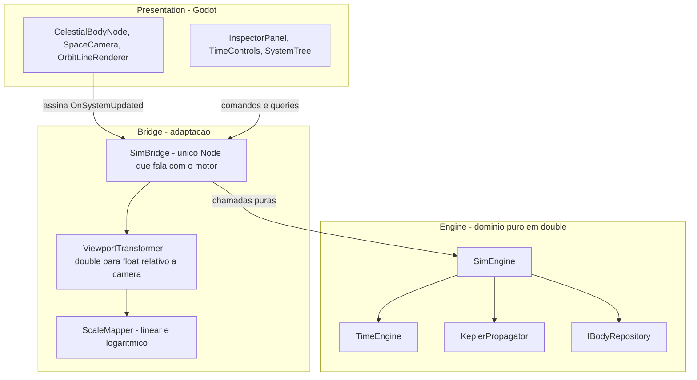
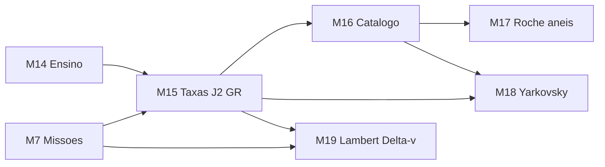

# Roadmap — Solar Sim (Godot + C#)

Plano de execução derivado da especificação de engenharia: solução analítica de Kepler
para o problema de dois corpos, sobre uma arquitetura em camadas com inversão de
dependência.

**Objetivo do produto:** não é um simulador fechado, e sim uma base sobre a qual construir
algo maior depois (missões espaciais, transferências orbitais). Isso muda o projeto do
motor: capacidades que num simulador puramente visual seriam luxo — vetor de estado,
conversão inversa de órbita, cônicas abertas — aqui são fundação.

**Estratégia:** fatia vertical primeiro. O marco M1 atravessa todas as camadas de forma
rasa e coloca a Terra girando na tela antes de qualquer camada estar completa. Só depois
cada camada é aprofundada. Isso valida a arquitetura cedo, quando corrigir ainda é barato.

**Legenda de status:** `[ ]` pendente · `[~]` em andamento · `[x]` concluído

---


## Invariantes arquiteturais

Estas quatro regras valem para todo o projeto e estão espelhadas em `.cursor/rules/`.
Violá-las não gera um bug imediato e visível — gera erosão silenciosa que só aparece
muitos marcos depois, quando o conserto já é caro.

1. **Nenhum arquivo em** `Engine/` **contém** `using Godot`**.** O motor deve compilar e ser
  testado sem o Godot sequer instalado. Essa é a definição operacional de domínio puro.
2. **Toda matemática do domínio em** `double`**.** A conversão para `float` acontece somente
  na camada Bridge, e somente *depois* de subtrair a posição da câmera. Converter antes
   é exatamente o que produz trepidação em objetos distantes da origem.
3. **Unidades internas: quilômetros, segundos, radianos.** Graus existem apenas na
  fronteira do JSON e no texto exibido ao usuário.
4. **O estado é função pura da Data Juliana.** Nada de integração acumulativa. É essa
  propriedade que entrega de graça o tempo reverso, o salto para uma data arbitrária e o
   save/load trivial: salvar o mundo inteiro é salvar um `double`.


### Convenção de unidades


| Grandeza                | Unidade              | Observação                            |
| ----------------------- | -------------------- | ------------------------------------- |
| Distância               | km                   |                                       |
| Tempo (física)          | segundos             |                                       |
| Tempo (calendário)      | Data Juliana em dias | Época J2000.0 = 2451545.0             |
| Ângulos                 | radianos             | Convertidos de graus na carga do JSON |
| Parâmetro gravitacional | km³/s²               | Mesma unidade em que o JPL publica GM |


A escolha de km e segundos alinha o projeto com a literatura de astrodinâmica e com as
tabelas do JPL, evitando uma camada de conversão no dia em que as transferências orbitais
entrarem. O custo é converter `Δt` de dias para segundos no propagador, o que é uma
multiplicação por 86400 em um único ponto do código.

---


## Arquitetura em camadas




### Por que a camada Bridge existe

O diagrama da especificação previa uma camada de adaptação, mas a estrutura inicial de
pastas tinha apenas `Engine/`, `Render/` e `UI/`. Sem um lugar próprio, duas
responsabilidades escorregam para dentro de `Render/`:

- a conversão `double` para `float` relativa à câmera, que é o único ponto onde a precisão
do sistema pode ser destruída;
- o mapeamento de escala linear e logarítmico.

Espalhadas por vários nós gráficos, essas duas regras acabam duplicadas e divergentes, e
a fronteira arquitetural vira apenas um comentário no README. Concentradas em `Bridge/`,
existem em um lugar só e podem ser testadas isoladamente.

`SimBridge` é o único nó do Godot que conhece o `SimEngine`. Todos os demais nós assinam
o evento de snapshot. Isso mantém o número de pontos de acoplamento entre os dois mundos
igual a um.

---


## Estado do ambiente

Instalado e verificado: **.NET SDK 10.0.302** e **Godot 4.7.1 (variante .NET)**. A solução
compila sem avisos e os testes rodam com o editor fechado.

Os projetos alvejam `net8.0` (motor e projeto Godot) e `net10.0` (testes). O Godot 4.7
exige no mínimo .NET 8, e a recomendação oficial é manter o SDK mais recente instalado
independentemente do alvo.

---


## M0 — Ambiente e esqueleto compilável

Objetivo: sair do zero absoluto para um projeto que compila, abre no Godot e roda testes.

- [x] .NET SDK 10.0.302 instalado e verificado com `dotnet --info`
- [x] Godot 4.7.1 na variante .NET (o pacote se chama `GodotEngine.GodotEngine.Mono`;
  ```
  o nome "Mono" é histórico e não indica o runtime antigo)
  ```
- [x] `solar-sim-godot.csproj` com `Godot.NET.Sdk/4.7.1`, `EnableDynamicLoading` e
  ```
  `Nullable`, excluindo `Engine/**` e `Tests/**` dos globs de compilação
  ```
- [x] `project.godot` com `config_version=5` e cena principal apontando para `Main.tscn`
- [x] Cenas mínimas válidas em `Scenes/`, sem as quais o projeto não abre
- [x] `Engine/SolarSim.Engine.csproj` como biblioteca separada
- [x] `Tests/SolarSim.Tests.csproj` (xUnit) referenciando apenas `Engine/`
- [x] `solar-sim-godot.sln` no formato clássico, agregando os três projetos
- [x] Teste-guardião do invariante 1 em `Tests/ArchitectureTests.cs`
- [x] `.gdignore` em `Engine/` e `Tests/`, para o Godot não tratá-los como pastas de script
- [x] Regras do projeto em `.cursor/rules/`, `AGENTS.md`, `.gitignore`, `.gitattributes`,
  ```
  `.editorconfig` e `README.md`
  ```


### Decisão: o motor é um projeto separado

Em vez de deixar `Engine/` dentro do projeto do Godot e confiar em disciplina, ele virou
uma biblioteca própria que não referencia o `GodotSharp`. O projeto do Godot e os testes
dependem dela por `ProjectReference`.

Com isso, o invariante 1 deixa de ser convenção e passa a ser garantido pelo compilador:
escrever `using Godot` em `Engine/` simplesmente não compila. O teste-guardião continua
existindo para pegar o caso em que alguém adiciona a referência ao `.csproj` do motor.

**Pronto quando:** `dotnet build` ~~passa, o Godot abre o projeto sem erro, e um teste
trivial roda com o editor fechado.~~ **Concluído:** build sem avisos, dois testes
passando, e `--headless --import` seguido de execução da cena principal com código de
saída 0.

---


## M1 — Fatia vertical: a Terra na tela

O marco mais importante do roadmap. Objetivo: o caminho mais curto que toca **todas** as
camadas, provando que a arquitetura funciona de ponta a ponta antes de investir em
profundidade. Tudo aqui é intencionalmente mínimo.

Corte mínimo por camada:

- [x] `Engine/Core/AstroConstants.cs` — J2000, GM do Sol e da Terra, UA, normalização
  ```
  de ângulo
  ```
- [x] `Engine/Models/Vector3D.cs` — `readonly record struct` com operadores, produto
  ```
  escalar e vetorial
  ```
- [x] `Engine/Models/OrbitalElements.cs` — os seis elementos, com fábrica que aceita UA
  ```
  e graus, que é como as tabelas de efemérides publicam
  ```
- [x] `Engine/Models/SystemStateSnapshot.cs` — `BodyState` e o snapshot publicado
- [x] `Engine/Core/TimeEngine.cs` — UTC para JD e de volta, acúmulo por delta e
  ```
  multiplicador, pausa, tempo reverso
  ```
- [x] `Engine/Core/KeplerPropagator.cs` — caso elíptico com Newton-Raphson e `atan2`
- [x] `Engine/Data/IBodyRepository.cs` + `HardcodedBodyRepository` com Sol e Terra
- [x] `Engine/SimEngine.cs` — lista plana, snapshot reaproveitado e evento
- [x] `Bridge/ScaleMapper.cs` — modo linear e regra provisória de raio visual
- [x] `Bridge/ViewportTransformer.cs` — subtração da câmera em `double`, conversão a `float`
- [x] `Bridge/SimBridge.cs` — `_Process` avança o tempo e publica `RenderFrame`
- [x] `Render/CelestialBodyNode.cs` e `Render/SpaceCamera.cs` — andaime 2D com zoom
- [x] `UI/TimeControls.cs` — pausa, velocidade e data por teclado
- [x] `Scenes/Main.tscn` com o `SimBridge` como raiz
- [x] 23 testes cobrindo tempo, propagador e orquestração

O repositório entra como interface já no M1, com implementação hardcoded, justamente para
adiar a discussão de schema do JSON até o M3 sem criar dívida: quando o
`JsonBodyRepository` chegar, ele entra pela mesma porta e nada acima precisa mudar.

### Desvios em relação ao plano original

- **Conversão JD para UTC entrou antecipada.** O plano deixava a inversa para depois, mas
sem ela não há como mostrar a data na tela, e a data é justamente como se confere que a
Terra completou uma volta.
- **A árvore de nós é montada em código, não em** `.tscn`**.** Como a decisão entre 2D e 3D só
aconteceria no M6, construir os nós em código evitava refazer arquivos de cena.
`Main.tscn` tem um nó só, com o `SimBridge`. A aposta se pagou: a migração para 3D no M6
não teve nenhuma cena para reconstruir, e o stub `Scenes/Prefabs/CelestialBody.tscn`, que
nunca chegou a ser usado, foi removido lá.
- `ImplicitUsings` **precisou ser ligado** no projeto do Godot; o `Godot.NET.Sdk` não o
habilita por padrão, ao contrário dos outros dois projetos.

**Pronto quando:** ~~a Terra descreve uma volta completa em torno do Sol na tela, com
play/pause funcionando e velocidade temporal ajustável.~~ **Concluído:** build sem avisos,
23 testes passando, e execução headless de 180 quadros com código de saída 0. A órbita é
verificada numericamente pelos testes de periélio/afélio e de retorno ao ponto de partida
após um período.

---


## M2 — Rigor numérico

Objetivo: transformar "parece certo" em "está comprovadamente certo". A partir daqui o
motor é confiável o suficiente para construir em cima.

- [x] Newton-Raphson com tolerância `1e-12`, teto de iterações e chute inicial adaptado
  ```
  para excentricidade alta (`E₀ = π` quando `e > 0.8`) — já entregue no M1
  ```
- [x] Normalizar a anomalia média para `[0, 2π)` antes de resolver — já no M1
- [x] Anomalia verdadeira por `atan2` — já no M1
- [x] Vetor velocidade, com `StateVector` preenchido (antecipado do M7)
- [x] Rotação completa `Rz(-Ω)·Rx(-i)·Rz(-ω)`, generalizada para aceitar qualquer vetor
  ```
  do plano orbital, e não apenas raio e anomalia
  ```
- [x] Marte acrescentado ao repositório, necessário para a comparação de referência
- [x] Contagem de iterações exposta pelo solver, para o critério ser verificado
- [x] `SimEngine.StateAt`, `ElementsOf` e `GravitationalParameterOf` para consulta de estado
- [x] Testes de invariantes: energia orbital específica, momento angular e a relação
  ```
  entre energia e semi-eixo maior
  ```
- [x] Regressão contra efemérides geométricas do JPL Horizons (solução DE441)


### Resultado da validação

Comparação com o JPL Horizons para o baricentro Terra-Lua e o de Marte, em 2000-01-01,
2013-01-01 e 2026-01-01, referencial eclíptico J2000 centrado no Sol:


| Grandeza                 | Erro máximo observado | Critério |
| ------------------------ | --------------------- | -------- |
| Distância radial         | 0,0132%               | 0,1%     |
| Direção do vetor posição | 0,0928°               | —        |
| Velocidade               | 0,0120%               | —        |


O erro cresce com a distância à época, como esperado de um modelo de elementos fixos: a
Terra sai de 0,0003% em J2000 para 0,0041% em 2026. O pior caso é sempre Marte em 2026.
Reduzir isso não é questão de ajustar o propagador, e sim de adotar taxas seculares nos
elementos, que é o primeiro item do backlog.

Os limites dos testes ficaram propositalmente próximos do erro medido (0,02% no raio,
0,15° na direção) para que sirvam de detector de regressão, em vez de apenas confirmar a
ordem de grandeza.

**Pronto quando:** ~~posições de Terra e Marte conferem com o JPL Horizons em três datas
distintas, com erro relativo abaixo de 0,1% na distância radial, e o solver converge em
menos de dez iterações para todo~~ `e < 0.95`~~.~~ **Concluído:** erro radial máximo de
0,0132%, sete vezes melhor que o critério. A convergência em menos de dez iterações é
verificada para `e` de 0 a 0,94, varrendo 720 valores de anomalia média em cada
excentricidade. 41 testes passando.

Os números acima são os medidos hoje. Eram 0,0133%, 0,0937° e 0,0121% no fechamento do
M2; a diferença veio do parâmetro gravitacional efetivo adotado no M3.

---


## M3 — Sistema completo e hierarquia

Objetivo: sair de dois corpos hardcoded para o Sistema Solar real, com luas.

- [x] Definir o schema de `Data/solar_system_j2000.json`, com unidades explícitas no
  ```
  próprio arquivo
  ```
- [x] Popular Sol, oito planetas, Lua, galileanas e Titã
- [x] `Engine/Data/DataLoader.cs` e `JsonBodyRepository` implementando `IBodyRepository`,
  ```
  convertendo graus para radianos na carga
  ```
- [x] Validação na carga: corpo pai inexistente, ciclo na hierarquia, `a <= 0`, campos
  ```
  ausentes — com mensagem de erro que diga qual corpo e qual campo
  ```
- [x] Ordem de avaliação garantindo pai antes de filho
- [x] Composição recursiva `P_global(A) = P_global(Pai(A)) + P_local(A)`
- [x] Remover a implementação hardcoded


### O schema

A unidade vive no nome do campo, e não em um cabeçalho distante: `radiusKm`,
`inclinationDeg`, `muKm3S2`. O semi-eixo aceita duas grafias, `semiMajorAxisAu` e
`semiMajorAxisKm`, porque as fontes usam escalas diferentes para planetas e satélites;
declarar as duas ao mesmo tempo é erro. O documento também traz `epoch`, conferido contra
J2000.0 na carga, e campos de documentação (`frame`, `sources`, `notes`, `note`) que o
motor lê e ignora — existem para quem abre o arquivo.

### Decisões e desvios

**O parâmetro gravitacional passou a ser o efetivo,** `mu(pai) + mu(corpo)`**.** É a forma
correta da equação do movimento relativo de dois corpos. Para um planeta em torno do Sol a
correção é imperceptível; para a Lua vale 1,2% e é a diferença entre um mês sideral de
27,45 e um de 27,32 dias. O efeito colateral foi melhorar de leve os números do M2.

**A hierarquia virou um objeto próprio,** `BodyHierarchy`**.** A validação de pai inexistente,
ciclo e raiz única não é específica do JSON: vale para qualquer implementação de
`IBodyRepository`. Ficando separada, o `DataLoader` a aplica na carga e o `SimEngine` a
aplica sobre o que quer que receba, com uma implementação só.

**Campo com nome desconhecido é erro, não é ignorado.** `raioKm` em vez de `radiusKm`
seria aceito em silêncio pelo comportamento padrão do desserializador, e o corpo apareceria
com raio errado sem nenhum aviso.

**Satélites usam a eclíptica como plano de referência.** O correto seria o equador do
planeta, que exige modelar obliquidade. A aproximação afeta a orientação do plano orbital,
não o tamanho nem a forma da órbita — que é justamente o que o critério de pronto mede. A
fase de Titã não foi validada contra efemérides, e o arquivo diz isso.

**A leitura do arquivo ficou na Bridge.** No jogo exportado os dados vivem dentro do pacote
e só o `FileAccess` do Godot sabe abri-los. O motor recebe o texto já lido, então continua
sem saber que o Godot existe.

**Pronto quando:** ~~a distância Terra–Lua permanece dentro da faixa real (363.000 a 406.000
km) ao longo de um século simulado. Esse teste é o que prova que a composição hierárquica
não acumula erro.~~ **Concluído:** a distância varia entre 363.625 km e 405.871 km em
73.051 amostras cobrindo 36.525 dias — dentro da faixa, e encostando no perigeu e no
apogeu previstos pelos elementos a menos de um quilômetro no fim do século. As
galileanas acompanham Júpiter com a razão de períodos 1:2:4 da ressonância de Laplace, e
os oito planetas ficam entre periélio e afélio ao longo do mesmo século. 80 testes
passando, sendo 39 novos.

---


## M4 — Escalas e navegação

Objetivo: tornar o Sistema Solar navegável, que é o problema visual central — em escala
real, os planetas são invisíveis.

- [x] Modo logarítmico perceptual:
  ```
  `r_vis = ln(1 + α·r) / ln(1 + α·r_max) · R_tela`
  ```
- [x] Escala independente para o raio dos corpos, desacoplada da escala de distância
- [x] Transição suave entre os modos linear e logarítmico
- [x] `Render/SpaceCamera.cs` completo: zoom exponencial, pan, ancoragem em um corpo,
  ```
  transição suave ao trocar de alvo
  ```
- [x] `Render/OrbitLineRenderer.cs`: amostragem de um período completo via propagador,
  ```
  com cache invalidado apenas por mudança de escala ou de câmera
  ```
- [x] `Render/BodyLabels.cs` — fora do plano original, pedido depois de rodar: sem os
  ```
  nomes, quinze pontos coloridos não dizem qual é qual
  ```


### Decisões e desvios

**A escala é hierárquica, e não um mapa único sobre o raio heliocêntrico.** A fórmula do
plano, aplicada à distância até o Sol, coloca a Lua e a Terra no mesmo pixel: a órbita
lunar é 390 vezes menor que a terrestre, e a de Io é 300 vezes menor que a de Júpiter.
Cada pai passou a ter o seu próprio mapa, dimensionado pela maior órbita que abriga, e a
posição projetada de um corpo é a do pai mais o deslocamento local já escalado. O `α` é
declarado como fator adimensional de compressão, e não em unidades de distância, para que
a mesma curva sirva ao Sistema Solar e ao sistema de Júpiter.

**O snapshot passou a publicar a posição local junto da global.** É o dado que a escala
hierárquica consome, e o motor já o tinha em mãos ao compor a posição global.

**A câmera olha para o espaço projetado, não para quilômetros.** Como o mapa perceptual é
não linear em torno do Sol, escalar primeiro e subtrair o foco depois é a única ordem que
funciona. O invariante 2 continua valendo, e com folga: a subtração acontece em `double` e
o `float` só aparece no fim, sobre um número que já é pequeno.

**A transição entre alvos tem duração fixa em vez de suavização exponencial.** A
suavização exponencial nunca alcança o alvo, e com o tempo acelerado isso deixa o corpo
ancorado tremendo fora do centro — exatamente o defeito que o marco quer eliminar.

**A matemática de escala e de câmera é compilada também pelo projeto de testes.** Ela vive
em `Bridge/`, que faz parte do projeto do Godot e não pode ser referenciado pelos testes.
Como nenhum desses quatro arquivos toca no Godot, eles entram no projeto de testes por
`Compile Include`. Se algum passar a tocar, o build dos testes quebra, que é o aviso certo
na hora certa.

**Os rótulos ficam em uma camada de tela, não no mundo.** Como nós do mundo, a câmera os
ampliaria junto com tudo, e o nome de Júpiter ocuparia a tela inteira no zoom máximo. Na
camada de tela têm sempre o mesmo tamanho, e quem se sobrepõe é descartado na ordem de
avaliação — o que faz o planeta ganhar do satélite quando o sistema está distante.

**Pronto quando:** ~~com a câmera ancorada em Netuno, não há trepidação visual em nenhum
nível de zoom, e o Sistema Solar completo com órbitas se mantém acima de 60 fps.~~
**Concluído:** o desempenho foi confirmado em execução, com o sistema completo e as
órbitas desenhadas, e nenhuma trepidação foi observada. Numericamente, com a âncora em
Netuno o corpo ancorado cai exatamente no centro da tela, e um deslocamento de um
centésimo de pixel sobre a posição projetada dele ainda sobrevive à conversão para
`float`. 114 testes passando, sendo 34 novos.

---


## M5 — Interface

- [x] `UI/TimeControls.cs` — play/pause, multiplicador (1x, 1000x, 100000x, 10⁷x), data
  ```
  legível, entrada de data arbitrária, retorno a J2000, tempo reverso
  ```
- [x] `UI/SystemTree.cs` — árvore hierárquica navegável; selecionar ancora a câmera
- [x] `UI/InspectorPanel.cs` — elementos orbitais, distância ao pai e ao Sol, velocidade
  ```
  instantânea, período, dados físicos
  ```
- [x] `Bridge/BodyReport.cs` — o retrato consultado ao motor que alimenta o inspetor
- [x] `Bridge/DisplayFormat.cs` — número do domínio em texto, com escolha de unidade
- [x] `UI/Panels.cs` — fora do plano original: a caixa, os rótulos e os botões comuns aos
  ```
  três painéis
  ```


### Decisões e desvios

**A UI conversa com um** `SimBridge` **de fachada, e não com o motor.** O `SimBridge` deixou
de expor a propriedade `Sim` e passou a oferecer os comandos e as consultas que a
interface precisa — pausar, mudar a velocidade, inverter o tempo, saltar para uma data,
ancorar, pedir o retrato de um corpo. Com `Sim` público, cada painel novo teria a
tentação de chamar o motor direto, e o número de pontos de acoplamento entre os dois
mundos deixaria de ser um. `CameraRig` seguiu o mesmo caminho e virou campo privado.

**O que o inspetor mostra é um valor, não um objeto observável.** `BodyReport` é montado
por consulta ao motor a cada atualização e descartado em seguida. É a forma mais direta de
garantir o critério de pronto: não existe onde guardar um número desatualizado. O painel
possui apenas os rótulos em que escreve.

**O retrato e a formatação moram na Bridge, e por isso são testados.** Ambos são conversão
de unidade na fronteira, que é a definição da camada, e nenhum dos dois toca no Godot —
então entram no projeto de testes pelo mesmo `Compile Include` que já trazia a matemática
de escala. Dezessete testes novos cobrem a separação entre velocidade local e global, o
acordo entre a anomalia verdadeira exibida e a equação da cônica, e a independência da
formatação em relação à cultura do sistema.

**O inspetor atualiza a 10 Hz, não a cada quadro.** A 60 Hz os dígitos finais piscam
rápido demais para serem lidos, e reconsultar o motor a cada quadro não acrescenta
informação nenhuma.

**A velocidade tem módulo e sentido separados.** Acelerar com o tempo invertido acelera
para trás, em vez de voltar a andar para a frente. O módulo fica preso entre 1x e 10⁹x, e
inverter é só trocar o sinal — o que sai de graça do invariante 4.

**A ajuda de teclado saiu da tela e foi para trás da tecla H.** Ela ocupava oito linhas
permanentes sobre o sistema; agora a barra inferior mostra só o estado do relógio, a
escala, a âncora e a taxa de quadros.

**As linhas relativas ao pai desaparecem quando o pai é a raiz.** Para um planeta, a
distância ao pai e a distância ao Sol são o mesmo número, e mostrar as duas linhas parecia
defeito. Elas só têm o que dizer para um satélite: a Lua faz 1,011 km/s em torno da Terra
enquanto faz 30,742 km/s em torno do Sol. Esconder as duas células fecha a linha de fato,
porque um contêiner do Godot só distribui espaço entre os filhos visíveis.

**Os rótulos dos corpos passaram a respeitar as faixas ocupadas pela interface.** Com os
painéis nas bordas, o nome de Netuno aparecia metade escondido atrás da barra de tempo.
`BodyLabels` agora exige que o rótulo caiba inteiro na área livre, em vez de aceitar
qualquer sobreposição com a tela. Quem informa as faixas é o `SimBridge`, que monta a
cena e é o único que sabe ao mesmo tempo da existência dos painéis e dos rótulos — assim
`Render/` continua sem depender de `UI/`.

**A calibragem da escala virou fração da altura da janela.** `ScaleLayout` reservava 300
pixels para o nível dos planetas, número escolhido para a janela de 648 de altura em que
o M4 foi ajustado. Ao abrir o projeto a 1080 de altura, o sistema inteiro continuava nos
mesmos 600 pixels no meio de uma tela quase duas vezes maior, e Netuno voltava a ser
cortado. As três medidas passaram a ser frações da altura recebida no construtor, e o
fator do modo linear acompanha a mesma proporção. A janela agora é 1920x1080; o valor de
648 sobrevive apenas como `ScaleLayout.ReferenceHeightPixels`, a altura em que as frações
foram calibradas. A interface não escala junto de propósito: 12 pixels de fonte é tamanho
de aplicação de desktop, e crescer com a resolução só a deixaria desproporcional.

### Confirmação visual

Verificado com quadros renderizados pelo modo Movie Maker do Godot, a 1920x1080, com a
câmera ancorada no Sol, em Júpiter e na Lua. Os números do inspetor conferem com o que os
marcos anteriores mediram: para a Lua, semi-eixo de 384.748 km, período de 27,32 dias e
periápside e apoápside de 363.625 km e 405.871 km — os mesmos extremos do teste de um
século do M3. A árvore acompanha a âncora, e o corpo ancorado cai no centro da tela.

**Pronto quando:** ~~todo dado exibido vem do snapshot ou de consulta ao motor. Nenhum
componente de UI mantém cópia própria de estado da simulação.~~ **Concluído:** build sem
avisos, 134 testes passando — sendo 20 novos — e execução com código de saída 0 sem
nenhum erro. Nenhum dos três painéis declara campo de estado da simulação, só referências
aos rótulos em que escreve, e o compilador ajuda a manter isso: o motor não é mais
alcançável a partir de `UI/`.

---


## M6 — Ponto de decisão 2D/3D — **Concluído**

Marco de reavaliação explícito, não de implementação. Até aqui, `Render/` era um andaime 2D
declaradamente descartável.

- [x] Decidir entre manter 2D ou migrar para Node3D, agora com o sistema real em mãos
- [x] Se migrar: câmera orbital em três eixos, profundidade
- [x] ~~iluminação~~ — recusada; a justificativa está abaixo


### A decisão: migrar, com câmera ortográfica

**O custo previsto estava subestimado, mas na camada certa.** O plano dizia quatro arquivos
e afirmava que `Bridge/` não mudaria. A segunda parte estava errada: o colapso de três
dimensões para duas nunca esteve em `Render/`, e sim na própria ponte — `RenderFrame`
publicava `Vector2`, o `ViewportTransformer` descartava o Z na conversão e o
`OrbitSampleToPixels` fazia o mesmo. A conta real foi de seis arquivos, somando `BodyLabels`
e os dois da Bridge. O que se confirmou, e é o que importava, é que `Engine/` não mudou uma
linha: a física estava mesmo protegida, e o preço ficou todo na adaptação.

**A informação descartada é real, mas modesta.** Medida em pixels de excursão fora do plano
da eclíptica, na escala em que o sistema cabe na tela: Netuno 15,4, Saturno 14,9, Mercúrio
6,2 e a Lua 5,1. Como fração do raio orbital desenhado, Mercúrio lidera com 11% e a Lua vem
com 9%; as galileanas são praticamente coplanares. Ou seja, vista de cima, a tela em 3D é
quase indistinguível da de antes — o ganho só aparece ao inclinar a câmera.

**A projeção é ortográfica, e essa é a escolha que destravou a decisão.** A objeção séria ao
3D seria a perspectiva brigar com a escala hierárquica: ela encolhe o que está longe da
câmera, mas a curva logarítmica já mentiu sobre a distância de cada corpo, e as duas
distorções somadas fariam o tamanho na tela deixar de significar qualquer coisa. Sem
perspectiva o conflito não existe. Com elevação de 90 graus a imagem é a mesma que o andaime
2D produzia — verificado por diferença de quadros: 0,7% dos pixels mudam, todos sobre o
traço das órbitas, e o mapa de diferenças mostra uma curva só, e não duas paralelas, o que
prova que a geometria não se moveu. O que resta é arredondamento de rasterização.

**Sem iluminação, contra o que o plano previa.** A vista é um esquema: as distâncias estão
comprimidas por uma curva logarítmica e os raios têm escala própria, sem relação com a das
distâncias. Iluminar a partir do Sol sugeriria um realismo que a escala não tem, e deixaria
metade de cada corpo — que ocupa entre três e quinze pixels — no escuro, sem nada em troca.
Os materiais são sem sombreamento, e por isso a esfera na tela é o mesmo disco de cor cheia
de antes.

**O que pesou a favor foi o M7.** Mudança de plano, transferências e esfera de influência
são fenômenos tridimensionais; um plane change é justamente o que não há como mostrar em
duas dimensões. Somado a custo limitado, momento mais barato possível e regressão visual
nula, a migração passou a não ter contra.

### Consequências

`SimBridge` virou `Node3D` e publica `Vector3`. A convenção de eixos mora em um lugar só,
no `ViewportTransformer`: a eclíptica tem X e Y no plano e Z para o norte, o Godot tem Y
para cima, e o mapeamento entre os dois é uma rotação. A seleção por clique passou a
comparar em pixels de tela, o que de quebra deu tolerância de clique constante em qualquer
zoom. O arrasto virou dois gestos, porque agora existe o que girar: o botão direito orbita,
e o do meio — ou Shift com o direito — desloca.

**Pronto quando:** ~~a decisão está tomada e registrada neste documento com a
justificativa.~~ **Concluído:** decisão registrada acima, migração feita, build sem avisos,
134 testes passando e equivalência visual com o 2D verificada por diferença de quadros.

---


## M7 — Fundações para missões

Objetivo: as capacidades que transformam o simulador em base para transferências orbitais
e missões. Estão aqui, e não no backlog, porque algumas delas influenciam o desenho das
estruturas desde o M1.

- [x] `Engine/Models/StateVector.cs` — posição e velocidade como tipo de primeira classe,
  ```
  com energia específica e momento angular (antecipado no M2)
  ```
- [x] Conversão `OrbitalElements` para `StateVector` via `KeplerPropagator.StateAt`
- [x] Conversão inversa `StateVector` para `OrbitalElements` — o problema inverso, que é o
  ```
  que permite criar um corpo a partir de posição e velocidade arbitrárias, e portanto
  o que permite existir uma nave
  ```
- [x] Órbitas com `e > 1`: hiperbólicas. A parábola exata foi recusada, e a justificativa
  ```
  está abaixo
  ```
- [x] ~~Avaliar a formulação por variáveis universais~~ — avaliada e recusada; a
  ```
  justificativa está abaixo
  ```
- [x] Registro dinâmico de corpos em runtime, com adição e remoção fora do JSON
- [x] Esfera de influência e reatribuição de corpo pai (cônicas emendadas)
- [x] Save/load, que graças ao invariante 4 é serializar `JD` mais os corpos dinâmicos

### Decisões e desvios

**A parábola exata foi recusada, e não esquecida.** Com `e` exatamente 1 o semi-eixo maior
é infinito e a metade da formulação deixa de existir: não há período, não há anomalia
média no sentido usual, e `a(1-e²)` vira zero vezes infinito. Pior, é um caso de medida
nula — nenhuma trajetória real tem `e = 1`, e uma que tivesse deixaria de ter na primeira
correção de rumo. `OrbitalElements.RequireRepresentableEccentricity` recusa a faixa em
torno de 1 dizendo isso, tanto na carga do JSON quanto na conversão inversa, em vez de
aceitar o valor e produzir `NaN` três camadas adiante. O semi-latus rectum é o que segura
a geometria nos dois ramos, e é ele, e não o semi-eixo, que a equação da cônica usa.

**As variáveis universais foram avaliadas e recusadas.** Elas resolvem exatamente um
problema: a transição contínua entre elipse, parábola e hipérbole, com um solver só. Como
a parábola saiu do domínio pela decisão anterior, o que sobraria seria trocar dois ramos
curtos — cada um com equação de Kepler conhecida, chute inicial estudado e convergência
medida em menos de dez iterações — por funções de Stumpff, um chute inicial menos óbvio e
uma reescrita do propagador que é justamente a peça com regressão contra o JPL desde o M2.
O custo é alto, o ganho é um caso que não existe, e a porta continua aberta: a decisão
está isolada atrás de `KeplerPropagator.StateAt`.

**Um corpo dinâmico tem trajetória, não órbita.** `Trajectory` é uma lista de
`TrajectoryArc`, cada arco com o instante em que começa, quem atraía o corpo e os
elementos daquele trecho. É o que permite consultar uma data anterior a uma emenda e
receber a resposta certa — sem isso, o invariante 4 se perderia justamente nos corpos
mais interessantes. O tempo reverso desfaz a emenda em vez de ignorá-la: um arco que
começa no futuro deixa de existir, e será redescoberto se o tempo voltar a passar ali.

**A emenda sai do vetor de estado, e por isso não dá salto.** Ao trocar de pai, o estado
global no instante da troca é medido em relação ao novo atrator e convertido em elementos.
Posição e velocidade no referencial global são as mesmas antes e depois; o que muda é só
quem é considerado responsável pela curva. É o teste que fecha o critério da emenda, e ele
mede a descontinuidade em metros e em milímetros por segundo.

**A árvore estática continua sendo a fonte da verdade para quem consulta.** Quando um arco
novo entra, o `CelestialBodyData` do corpo é reescrito com o pai e os elementos de agora.
O inspetor, a árvore do sistema e o desenho da órbita continuam perguntando as mesmas
coisas de sempre, e nenhum deles precisa saber que arcos existem. `CelestialBodyData`
virou `record` para que essa reescrita seja uma expressão `with`, e não mutação.

**O arquivo salvo não contém o Sistema Solar.** Pelo invariante 4, o estado de tudo o que
veio do JSON é função da data: gravá-lo seria gravar uma cópia redundante que ainda por
cima envelheceria mal se o arquivo de dados mudasse. O salvamento é a Data Juliana mais os
corpos que não estão no JSON, com a trajetória inteira — o histórico de emendas é o único
dado que não pode ser redescoberto, porque depende de por onde o corpo passou.

**A órbita passou a ser amostrada por anomalia verdadeira, e não por tempo.** É o que faz
a mesma rotina desenhar a elipse e a hipérbole: a hipérbole não tem período para dividir
em partes iguais. De quebra, a amostragem uniforme em ângulo concentra pontos perto do
periápside, que é onde a curvatura está. O traço aberto vai de assíntota a assíntota e não
fecha, parando a 92% do ângulo assintótico — a hipérbole vai ao infinito, e o resto seria
gastar vértices em uma reta.

**A conversão inversa usa** `atan2` **onde o livro usa** `acos`**.** Perto de inclinação
zero o cosseno é estacionário e o arco-cosseno amplifica o erro de arredondamento; a
Terra, com inclinação tabelada de -0,0000153°, era o caso que denunciava isso. Ω e ω saem
normalizados em `[0, 2π)`, e uma inclinação tabelada negativa volta como a forma canônica
equivalente: inclinação positiva com meia volta somada aos dois ângulos. É a mesma
trajetória, e existe um teste que verifica exatamente essa equivalência.

### Validação

Três frentes, além dos testes de propriedade:

- **Regressão contra o JPL Horizons para 1I/'Oumuamua**, o objeto interestelar com
`e = 1,20`. Na época dos elementos o estado bate com o do JPL até praticamente o número de
máquina; a 40 dias de distância o erro fica em 0,3% na posição, compatível com a
aceleração não gravitacional conhecida do objeto, que o modelo de dois corpos não tem.
- **Cruzamento com integração numérica.** Um Runge-Kutta de quarta ordem integra a mesma
condição inicial ao longo de uma passagem pelo periápside, na elipse e na hipérbole, e
concorda com o propagador analítico. São duas rotas independentes para o mesmo número.
- **Verificação em execução**, pelo modo Movie Maker: uma sonda solta da Terra a 1,15 vez
a velocidade de escape aparece na árvore, sai da esfera de influência da Terra dentro dos
27 dias simulados do trecho gravado e reaparece pendurada no Sol, com a elipse
heliocêntrica dela desenhada — periélio 0,95 UA, afélio 1,37 UA. Salvar e carregar pelo
`FileAccess` do Godot foi exercitado no mesmo caminho.

**Pronto quando:** ~~é possível inserir um corpo em runtime a partir de um vetor de estado
arbitrário, e ele é propagado corretamente junto com o resto do sistema.~~ **Concluído:**
inserir uma sonda a partir de posição e velocidade devolve, no instante da inserção, o
mesmo vetor de estado que foi dado, e a partir dali ela propaga junto com o resto —
inclusive trocando de atrator ao atravessar a esfera de influência. Build sem avisos e
386 testes passando, sendo 252 novos.

---


## Fase 2 — Motor ambiental e astrobiológico (M8–M14)

Depois do M7 o produto passa a responder também “como é a superfície?” — temperatura,
atmosfera, maré, habitabilidade — sem abandonar os quatro invariantes. O clima é
**função da Data Juliana e de perfis estáticos**, não integração acumulativa. Relatórios
ambientais seguem o padrão do `BodyReport` (consulta e descarte); o
`SystemStateSnapshot` continua só com posições.

Dados orbitais ficam em `Data/solar_system_j2000.json`. Perfis ambientais moram em
`Data/body_environment_j2000.json`, indexados por `bodyId`.

---


## M8 — Perfis ambientais e balanço térmico

- [x] `Engine/Models/BodyEnvironment.cs` — albedo, spin, atmosfera, propriedades estelares
- [x] `Engine/Data/EnvironmentLoader.cs` + `Data/body_environment_j2000.json`
- [x] `Engine/Core/ThermalCalculator.cs` — T de equilíbrio e estufa paramétrica
- [x] Testes: Vênus T > 700 K; Terra na faixa de água líquida superficial

**Pronto quando:** ~~o JSON ambiental carrega com o sistema; `dotnet test` valida Vênus e
Terra; o JSON orbital permanece intacto.~~ **Concluído.**

---


## M9 — Retenção atmosférica e magnetosfera

- [x] `AtmosphericEscape` — Jeans: retenção/perda por espécie
- [x] `MagnetosphereEstimator` — momento magnético heurístico e dose relativa
- [x] Relatório ambiental com retenção e radiação (`EnvironmentService`)
- [x] Testes: Marte vs Terra (perda / radiação); Vênus retém pesados

**Pronto quando:** ~~Marte e Terra distinguíveis nos testes sem UI.~~ **Concluído.**

---


## M10 — Aquecimento de maré e oceanos subsuperficiais

- [x] `TidalHeatingCalculator` — dissipação ∝ M_pai² R⁵ e² / a⁶
- [x] Presença de água líquida superficial vs subterrânea
- [x] Testes: Europa com oceano interno; Terra com água superficial

**Pronto quando:** ~~Europa positiva para oceano interno nos testes.~~ **Concluído.**

---


## M11 — Índice de habitabilidade e exposição Bridge/UI

- [x] `HabitabilityEvaluator` — BHI ∈ [0, 1]
- [x] `EnvironmentReport` / fachada `SimBridge.EnvironmentFor` / `HabitabilityFor`
- [x] `DisplayFormat` para K, pressão, BHI
- [x] Seção ambiental no `InspectorPanel`
- [x] Testes: Terra BHI > 0,85; Marte e Vênus bem abaixo

**Pronto quando:** ~~o inspetor mostra T, atmosfera, radiação, água e BHI do corpo ancorado.~~ **Concluído.**

---


## M12 — Rotação, ciclo diurno/sazonal e zonas

Absorve do backlog antigo: rotação axial, obliquidade e **insolação como número**
(sem fases 3D).

- [x] Uso real de período de rotação e obliquidade do perfil
- [x] `DiurnalSeasonalModel` — amplitude dia/noite e sazonal
- [x] `ZoneGridCalculator` — equador / temperada / polar, albedo efetivo f(JD)
- [x] Sem render de terminador

**Pronto quando:** ~~Terra com contraste equador–polo ao saltar JD; Marte com amplitude
diurna maior que a Terra.~~ **Concluído.**

---


## M13 — Biosignatures, eventos e tempo geológico

- [x] `BiosignatureEvaluator` — O₂+CH₄ e O₃
- [x] `GeologicalTimeModel` — L(t) e erosão atmosférica como f(JD − época)
- [x] Evento `PotentialBiosphereDetected` (debounce por corpo)
- [x] Teste de salto +1 Gyr (Terra / Marte)

**Pronto quando:** ~~salto geológico nos testes; evento dispara com BHI/assinatura;
save/load continua sendo JD (+ dinâmicos).~~ **Concluído.**

---


## M14 — HUD de ensino e análises

Absorve do backlog: HUD de ensino/explicações (sem lore narrativo).

- [x] Overlay acionável (`I`) com texto gerado dos flags do relatório
- [x] Comparação leve Terra vs corpo ancorado via fachada
- [x] Zero estado de simulação na UI (`TeachingExplain` + `TeachingHud`)

**Pronto quando:** ~~com Terra/Marte ancorados, a HUD explica BHI alto vs perda/radiação.~~ **Concluído.**

---


## Fase 3 — Astrodinâmica avançada (M15–M19)

Volta o foco à órbita e às missões, sem abandonar os quatro invariantes. A propagação
continua **analítica**: elementos que evoluem com o tempo por taxas / fórmulas fechadas
(`f(JD)`). Não há integrador N-corpos nesta fase.

**Decisões:**

- Catálogo de corpos menores **curado** no repositório + **importador offline** (CLI ou
  ferramenta explícita). Em runtime o simulador **não** consulta rede.
- Roche / anéis / Yarkovsky como avaliadores ou drifts seculares (espelho da Fase 2).
- Lambert + janelas Δv + **aplicar impulso** na sonda (novo `TrajectoryArc`).
- Encontro próximo híbrido, N-corpos global, VSOP/DE e geofísica interna ficam no
  **Backlog** sem número de fase.



---


## M15 — Elementos variáveis e perturbações seculares (J₂ + GR) — **Concluído**

- [x] `Engine/Models/OrbitalElementRates.cs` — quanto cada elemento anda por segundo
- [x] `Engine/Core/SecularPropagator.cs` — `ElementsAt(JD)` e `StateAt` com taxas
- [x] Schema JSON: `orbit.rates.*PerCentury`, `j2` e `equatorialRadiusKm`
- [x] `Engine/Core/SecularPerturbations.cs` — **J₂** (nodal e apsidal) e **GR** (apsidal)
- [x] `SimEngine` compõe com elementos avaliados em JD; `ElementsAt` e `SecularRatesOf`
- [x] Teste de ouro: periélio de Mercúrio a 43″/século
- [x] Regressão JPL intacta, por construção: sem taxa, o caminho é o mesmo de antes
- [x] Fora do plano: linha de precessão no inspetor, em ″/século ou em tempo de volta, e
  traço da órbita reamostrado quando a precessão passa da resolução do desenho

### Decisões e desvios

**A taxa entra em forma fechada, não como força por quadro.** É o que mantém o invariante
4: `SecularPropagator.ElementsAt` devolve os elementos já referidos ao instante pedido, e
o propagador de sempre os avalia com deslocamento zero. Saltar mil anos custa o mesmo que
avançar um segundo, e o tempo reverso continua saindo de graça — há teste medindo que um
século antes da época o periápside está atrasado exatamente o quanto estará adiantado um
século depois.

**Sem taxa, o caminho é o de antes — o mesmo, não um equivalente.** `StateAt` desvia para
o `KeplerPropagator` quando as taxas são todas zero. É isso que torna impossível este
marco mexer na regressão contra o JPL por arredondamento, e existe um teste comparando os
dois caminhos por igualdade exata, sem tolerância.

**Relatividade e achatamento são calculados, não declarados.** O arquivo só traz o que o
motor não modela, e a distinção está escrita no JSON: declarar em `rates` um efeito que o
motor já calcula seria contá-lo duas vezes. Hoje nenhum corpo declara taxa nenhuma; o que
move as órbitas é inteiramente física.

**A anomalia média ganhou uma integral.** Com o semi-eixo maior andando, o movimento médio
deixa de ser constante e M₀ + n·t passa a errar a fase, com erro que cresce sem limite. A
integral de n ao longo do trecho tem forma fechada para semi-eixo linear no tempo, e é ela
que está no motor — com um ramo em série de Taylor para deriva pequena, que é o caso real,
porque a forma fechada ali subtrairia dois números quase iguais. Nenhum corpo do arquivo
tem semi-eixo andando; a peça existe verificada para o M18, e é conferida contra
integração numérica por Simpson.

**Não há taxa para a anomalia média, e a ausência é proposital.** O avanço dela é o
movimento médio, que o motor já calcula do semi-eixo. Declarar as duas coisas permitiria
que discordassem, e a discordância só apareceria como posição errada ao longo da órbita,
séculos depois.

**Corpo dinâmico não precessa.** A órbita de uma sonda é o arco vigente, obtido de um vetor
de estado por um caminho que assume dois corpos puros; aplicar taxa ali faria a conversão
de ida e a de volta discordarem. O teste que fixa isso encontrou um defeito real: a
trajetória era registrada *depois* da remontagem, então uma sonda recém-criada nascia
precessando pelo achatamento do pai até a próxima emenda.

**O J₂ só é declarado para quem tem satélite no arquivo.** O achatamento afeta quem orbita
o corpo, não ele mesmo, então Sol, Terra, Júpiter e Saturno o têm e Marte não ganharia nada
com o campo. O raio de referência é o equatorial, e não o médio de `radiusKm`: o J₂ é
publicado contra ele, e a taxa escala com o quadrado da razão entre os dois.

**O inspetor mostra a órbita de hoje.** `BodyReport.Elements` passou a vir de `ElementsAt`,
e não dos elementos de J2000 — por isso a linha do argumento do periápside se mexe. A linha
"Anom. média (J2000)" virou "Anom. média", porque agora ela se refere à data exibida.

**O traço desenhado reamostra quando a precessão passa da resolução dele.** Amostrar a
órbita a cada quadro seria gastar 240 pontos por corpo para redesenhar a mesma curva:
Mercúrio gira o periápside um grau a cada oitenta anos. O corte é o passo da própria
amostragem — abaixo dele nenhum vértice se move um pixel, acima dele o desenho mentiria.
Na prática só as luas com J₂ forte reamostram, e ainda assim raramente.

**A precessão rápida sai como o tempo de uma volta.** Segundos de arco por século é a
unidade da literatura porque a literatura fala de planetas. O periápside de Io, empurrado
pelo J₂ de Júpiter, dá uma volta a cada quatro anos: em ″/século são trinta milhões, um
número que ocupa a coluna sem informar. Abaixo de dez mil anos por volta o inspetor
escreve "1 volta / 3,82 anos", que é a mesma taxa dita de um jeito que se lê.

### Validação

- **Mercúrio a 43″/século**, medido de duas formas independentes: pela taxa e pela
  diferença entre o argumento do periápside em J2000 e um século depois.
- **O achatamento do Sol é um milésimo do total** em Mercúrio, o que confirma que a
  precessão é relativística e não um artefato do J₂ solar.
- **Órbita baixa terrestre regride os nodos a 4,47°/dia** em inclinação de 51,6°, que é o
  caso didático conhecido do J₂; e na inclinação crítica de 63,4° o periápside para de
  girar, com o sinal invertendo dos dois lados.
- **A Lua não ganha a precessão que não é dela:** o perigeu lunar gira 360° em 8,85 anos
  por causa do Sol, e o modelo entrega menos de um grau por século. O teste fixa esse
  limite para que o número na tela não seja confundido com realismo que o motor não tem.
- **Verificação em execução**, pelo modo Movie Maker, com Mercúrio ancorado: o inspetor
  mostra "Precessão do periáps. 43,04 ″/século" e o painel inteiro continua cabendo.

**Pronto quando:** ~~Mercúrio tem precessão GR mensurável nos testes; save/load e tempo
reverso seguem `f(JD)`.~~ **Concluído:** build sem avisos e 430 testes passando, sendo 26
novos.

---


## M16 — Catálogo curado de corpos menores + importador offline — **Concluído**

- [x] `Data/minor_bodies_j2000.json` — 28 corpos: 4 do cinturão principal, 5 NEOs, 5
  troianos, 2 centauros, 5 cometas e 7 transnetunianos
- [x] `Engine/Models/BodyKind.cs` — classe dinâmica, `family` livre, `densityGCm3` opcional
- [x] `Engine/Core/BodyMass.cs` — GM da esfera equivalente, para quem não teve massa medida
- [x] `DataLoader.ParseCatalog` e `JsonBodyRepository.WithCatalog` — dois arquivos, uma
  hierarquia, validada junta
- [x] Inspetor: linha "Classificação" com classe e família; a SOI já vinha do M7
- [x] `Bridge/BodyFilter.cs` e caixas na árvore, uma por classe presente nos dados
- [x] `Tools/CatalogImporter` — CSV curado → JSON, validado pelo próprio carregador
- [x] Fora do plano: corpo menor não dimensiona nível de escala, e o `kind` retroagiu ao
  arquivo do sistema

### Decisões e desvios

**A classe é dinâmica, não física.** `BodyKind` diz onde o corpo vive e como se move —
cinturão, troiano, cometa, transnetuniano —, e não que rótulo a IAU lhe deu. "Planeta
anão" cortaria a lista em diagonal: Ceres é do cinturão principal e Plutão é
transnetuniano, e é onde eles estão que decide se aparecem juntos quando se liga um
filtro. O rótulo físico, quando importa, é texto livre em `family` — "Apolo", "Plutino",
"Troiano de Júpiter (L4)" —, que a interface exibe e sobre o qual o motor não opina.

**Corpo menor não dimensiona a escala, e essa é a decisão que salvou a tela.** A curva
perceptual é normalizada pela maior órbita do nível. Com Sedna no cálculo, cujo afélio
passa de mil unidades astronômicas, o Sistema Solar inteiro encolheria para acomodar um
ponto que passa a maior parte de onze mil anos longe demais para ser visto. Fora do
cálculo ele continua sendo desenhado — a curva não satura, apenas o coloca além do raio
nominal do nível. A propriedade que fica é forte: acrescentar corpos ao catálogo não move
um pixel do Sistema Solar, e há teste comparando os níveis com e sem catálogo.

**Massa por densidade, quando não há massa.** Só um punhado de corpos menores teve o GM
determinado por sonda ou por satélite; para o resto o que existe publicado é o diâmetro e
uma densidade típica da classe. O arquivo aceita `muKm3S2` **ou** `densityGCm3`, nunca os
dois, e a carga recusa quem traz ambos ou nenhum. É estimativa, e vale a pena porque sem
massa o corpo não tem esfera de influência nenhuma — nem no inspetor, nem na emenda de
cônicas. A fórmula é conferida contra o GM que a Dawn mediu em Ceres.

**A conversão de época é a razão de o importador existir.** As fontes publicam elementos
osculadores na época que lhes convém, e o motor referencia tudo a J2000.0. Só a anomalia
média é deslocável, pelo movimento médio: os outros cinco elementos são osculadores e, em
dois corpos, constantes — deslocá-los exigiria a perturbação que os move, que é justamente
o que o modelo não tem. Por isso o CSV pede ao Horizons os elementos já em J2000, e o
deslocamento fica como rede de segurança para uma fonte que não saiba entregá-los assim.
Órbita aberta é recusada com mensagem explícita, porque ali não há movimento médio que
sirva de relógio.

**O importador valida escrevendo o que o motor lê.** Antes de gravar, ele chama
`DataLoader.ParseCatalog` e monta o repositório junto com o arquivo do sistema. Um id
repetido, um pai inexistente ou uma classe que não é de corpo menor derrubam a ferramenta
sem tocar no arquivo que já estava lá. E há teste conferindo que o JSON versionado é
exatamente o que o CSV versionado produz: sem ele, nada impediria alguém de editar o
gerado à mão e deixar a fonte descrevendo outro catálogo — a pior divergência, porque o
programa continua funcionando.

**A visibilidade é da vista, não do arquivo.** O plano previa um campo de visibilidade no
JSON, e ele não existe. Visibilidade é decisão de quem olha, e guardá-la na fonte da
verdade da física seria pôr estado de interface onde ele envelheceria sem ninguém notar.
O `BodyFilter` mora na Bridge, e a árvore só oferece botão para as classes que os dados
realmente contêm: um catálogo sem cometas não ganha o botão de cometas.

**O `kind` retroagiu ao arquivo do sistema.** Os quinze corpos de
`solar_system_j2000.json` passaram a declarar `star`, `planet` ou `moon`. Sem isso a
classe seria um campo que só metade dos corpos tem, e toda leitura precisaria decidir o
que fazer com a ausência. Sonda criada em runtime entra como `spacecraft`, e a classe
sobrevive ao save/load.

**Nenhum corpo do catálogo declara `orbit.rates`.** Vale a mesma regra do M15: o que o
motor calcula sozinho não se declara, e o que ele não calcula não está medido para estes
corpos. O que falta neles — Júpiter empurrando o cinturão, a sublimação empurrando o
cometa — não é taxa secular publicada, e fingir que é seria pior que a omissão.

**Nenhum valor do inspetor decide a largura do inspetor.** O quadro gravado com Ceres
ancorada mostrou a ficha inteira cortada na borda direita da tela — não só a linha
comprida, todas elas. Um rótulo do Godot pede como largura mínima o texto inteiro, e a
caixa cede: bastou "Asteroide · Cinturão principal" para empurrar a coluna de valores para
fora do painel, e "470 km" virou "470 k". Era defeito latente desde sempre, e o corpo
menor foi só o primeiro texto longo a encontrá-lo. Agora os valores recortam com
reticências, e a classificação — a única prosa da ficha, e onde cortar esconderia
justamente a família — quebra em duas linhas.

**A classe não se repete quando a família já a diz.** "Troiano · Troiano de Júpiter (L4)"
gasta uma linha para gaguejar; "Asteroide · Cinturão principal" diz duas coisas. A junção
só acontece quando a família não começa pelo nome da classe.

**O GM ganhou casa decimal para corpo pequeno.** Arredondar sempre para inteiro servia
enquanto o menor corpo do arquivo era a Lua, com 4.903. Héctor tem 0,398, e "0 km³/s²" não
é um número arredondado: é a afirmação de que o corpo não tem massa, escrita logo acima de
uma esfera de influência que existe.

### Validação

- **Regressão contra o JPL Horizons** em duas datas distantes da época, com 12 pontos:
  Ceres 0,03%, Plutão 0,21%, Vesta 0,28%, Halley 0,35%, Eros 0,38% e Héctor 1,05% de erro
  radial. A ordem é a esperada e diz quem sente Júpiter — o troiano, preso a ele, é o pior
  caso por margem larga, e o cinturão principal fica uma ordem de grandeza melhor. A
  tolerância é 1,5%, contra os 0,02% dos planetas, e a diferença é dos corpos, não do
  propagador.
- **Períodos publicados** de Ceres, Vesta, Halley, Encke e Plutão, a 1%.
- **Os troianos compartilham o semi-eixo de Júpiter**, dentro de 2% — é o teste que
  denunciaria uma coluna deslocada no CSV, porque um asteroide qualquer não cai em 5,2 UA
  por acidente. Halley é retrógrado, e o periélio de Sedna está nas 76 UA que a põem fora
  do alcance de Netuno.
- **A esfera de influência de Ceres bate com os 78 mil km publicados**, o que prova que a
  massa derivada e o semi-eixo estão os dois certos ao mesmo tempo.
- **Os níveis de escala do Sol, da Terra e de Júpiter são idênticos** com e sem catálogo.
- **Verificação em execução**, pelo modo Movie Maker: os 28 corpos aparecem com a cor da
  classe e o rótulo, a árvore ganha as seis caixas de filtro sem cortar "Asteroide próximo
  da Terra", e o Sistema Solar ocupa a tela como antes. Foi ela que pegou o corte do
  inspetor, que nenhum teste veria. Com Ceres ancorada a ficha mostra "Asteroide · Cinturão
  principal" e "Esfera de influência 76.984 km"; com Héctor, "Troiano de Júpiter (L4)" e
  "GM 0,398 km³/s²".

**Pronto quando:** ~~catálogo carrega; importador valida como o loader atual; UI ancora um
corpo menor com família e SOI visíveis.~~ **Concluído:** build sem avisos e 483 testes
passando, sendo 51 novos.

---


## M17 — Limite de Roche, anéis e destino de satélites — **Concluído**

Avaliadores `f(JD)`, não simulação de fluidos.

- [x] `Engine/Core/RocheLimit.cs` — limite fluido e rígido, e o destino a partir do periápside
- [x] `Engine/Models/SatelliteFate.cs` — estável, em risco, desfeito
- [x] `Engine/Core/RingEvaluator.cs` — heurística de anéis, com Saturno positivo
- [x] `SimEngine.TidesOn` e `SimEngine.RingZoneOf`; `BodyReport` e duas linhas no inspetor
- [x] Flags de ensino `inside_fluid_roche`, `inside_rigid_roche` e `ring_zone`
- [x] Fora do plano: Fobos e Deimos entraram no arquivo de dados, e `BodyMass` ganhou a
  densidade a partir do GM

### Decisões e desvios

**Fobos entrou no arquivo, e é ele que dá sentido ao marco.** Sem um corpo dentro da zona
de Roche, o cálculo diria "estável" quinze vezes e não haveria como saber se estava
funcionando. Fobos orbita entre os dois limites de Marte, e é por isso que a superfície
dele é sulcada e que ele vai virar um anel em algumas dezenas de milhões de anos. Deimos
veio junto de propósito, como controle: mesma origem, densidade da mesma ordem, duas
vezes e meia a distância — e estável. É o par que mostra que o destino sai da órbita, e
não do material.

**O limite de Roche não precisa da constante gravitacional.** Escrito em densidades, ele
é `R_pai·(2ρ_pai/ρ_sat)^⅓` e parece pedir o raio do pai; trocando as densidades por GM e
raio, o raio do pai se cancela junto com o G, e sobram o raio do satélite e a razão entre
as massas. É a mesma equação escrita com o que se conhece melhor — a massa de um planeta
se mede com oito casas, o raio dele depende de onde se decide que a atmosfera termina. Há
teste conferindo que as duas formas dão o mesmo número.

**No caso do anel, quem se cancela é o raio do pai.** Um anel não tem satélite de que
tomar raio e massa, só material de densidade suposta; substituindo, o limite para
escombros de gelo passa a depender **só da massa do hospedeiro**. Dois planetas de mesma
massa e tamanhos diferentes têm o anel possível na mesma distância.

**São dois limites, e por isso três destinos.** Entre o rígido e o fluido está a faixa em
que a resposta depende de do que o corpo é feito: um corpo coeso aguenta, uma pilha de
escombros se alonga e se desfaz. Achatar isso em "sobrevive" ou "não sobrevive" seria
afirmar o que o modelo não sabe — e Fobos está exatamente nessa faixa.

**A comparação é com o periápside, não com o semi-eixo.** O corpo se parte no ponto de
maior aproximação, e uma órbita excêntrica que mergulha na zona de Roche uma vez por volta
já basta: foi assim que o Shoemaker-Levy 9 virou um colar de vinte fragmentos dois anos
antes de cair em Júpiter.

**A heurística de anéis não é geométrica, e é isso que a faz acertar.** A tentação é dizer
que tem anel quem tem zona de Roche larga — e por esse critério a Terra ganharia de
Saturno, porque a Terra é densa e a zona dela é proporcionalmente maior. O que falta à
Terra não é espaço, é gelo. As condições são três: haver faixa acima da superfície, o
corpo estar além da linha de gelo, e ele orbitar a estrela. A última é limite de escopo
declarado, não resultado: a vizinhança de uma lua é governada pela maré do planeta, e este
modelo de dois corpos não tem o que dizer sobre ela.

**A linha de gelo é 2,7 UA, e não foi escolhida para o teste passar.** A prova é onde ela
cai: entre Vesta e Ceres, os dois maiores do cinturão — um basáltico e seco, o outro com
gelo de água. É onde a mineralogia diz que ela deve cair.

**A distância que entra na linha de gelo é o semi-eixo maior.** Ter anel é propriedade do
corpo, não do mês. Com a distância instantânea, Ceres cruzaria a linha duas vezes por
volta e o veredito piscaria enquanto o tempo corre.

**A linha da maré some quando não diz nada.** Acima de 25 vezes o limite, o inspetor
esconde a linha: "estável a 622 vezes" é o que ele diria de Saturno contra o Sol, e é uma
linha gasta para informar que nada acontece. Abaixo disso a maré ainda é quantidade da
qual se fala — a Lua entra com 20, Io com 3,4 e Fobos com 0,87.

### Validação

- **O limite de Roche de Saturno cai na borda do anel A.** O modelo põe o teto da zona em
  2,24 raios, ou 130.600 km; a borda externa do anel A está a 136.775 km, 4,5% além. Não é
  coincidência: é a razão de os anéis terminarem onde terminam, porque além dali o material
  se junta em lua. É o número que valida o marco inteiro.
- **Fobos em risco a 0,87 do limite fluido**, com os dois limites de Marte em 10.600 e
  5.500 km, que são os valores publicados. Deimos estável, e as sete luas grandes também.
- **Os quatro gigantes têm anel e os quatro terrestres não**, sem exceção — e a Terra é
  recusada pela falta de gelo, com zona de sobra, o que o teste verifica separando as
  condições.
- **Cariclo, Haumea e Quaoar são aceitos** pelo mesmo critério que aceita Saturno, que é o
  resultado certo: são justamente os corpos pequenos em que anéis foram descobertos.
- **A densidade derivada do GM é a inversa exata do GM derivado da densidade**, sem o que o
  catálogo do M16 e a zona de anel discordariam sobre o mesmo corpo.
- **Verificação em execução**, pelo modo Movie Maker: com Fobos ancorado a ficha mostra
  "Maré do pai em risco (0,87× Roche)" e nenhuma linha de anel; com Saturno, "Zona de anel
  até 2,24 raios" e a linha da maré ausente.

**Pronto quando:** ~~testes distinguem lua estável vs interior a Roche; Saturno com
anéis.~~ **Concluído:** build sem avisos e 526 testes passando, sendo 43 novos.

---


## M18 — Yarkovsky e pressão de radiação (drift secular)

- [ ] Drift documentado em elementos (`da/dt`, etc.), não força por quadro
- [ ] Só corpos com parâmetros no JSON; planetas ignoram
- [ ] Teste de ordem de grandeza com fixture ou NEO conhecido

**Pronto quando:** corpo com parâmetros NG muda `a` com JD de forma testável; invariante 4
preservado.

---


## M19 — Lambert, janelas Δv e aplicar impulso

- [ ] `LambertSolver` (arco elíptico; hiperbólico só se couber sem estourar escopo)
- [ ] Preview: A, B, JD partida, tempo de voo → Δv (consulta via `SimBridge`)
- [ ] Varredura de janelas (grade JD × ToF)
- [ ] **Aplicar impulso** na sonda ancorada → novo `TrajectoryArc`

**Pronto quando:** Terra→Marte na ordem de grandeza esperada; preview não altera estado;
aplicar muda a trajetória de forma testável.

---


## Estrutura de arquivos alvo

```
solar-sim-godot/
├── .cursor/
│   └── rules/                       # convenções por camada, com exemplos
├── Data/
│   ├── solar_system_j2000.json
│   ├── body_environment_j2000.json  # perfis ambientais (M8+)
│   └── minor_bodies_j2000.json      # M16: gerado pelo importador, não editar à mão
├── Engine/                          # DOMÍNIO PURO (projeto próprio, zero Godot)
│   ├── SolarSim.Engine.csproj
│   ├── .gdignore
│   ├── Core/
│   │   ├── AstroConstants.cs
│   │   ├── TimeEngine.cs
│   │   ├── KeplerPropagator.cs
│   │   ├── OrbitDetermination.cs
│   │   ├── SphereOfInfluence.cs
│   │   ├── ThermalCalculator.cs         # M8
│   │   ├── AtmosphericEscape.cs         # M9
│   │   ├── MagnetosphereEstimator.cs    # M9
│   │   ├── TidalHeatingCalculator.cs    # M10
│   │   ├── HabitabilityEvaluator.cs     # M11
│   │   ├── DiurnalSeasonalModel.cs      # M12
│   │   ├── ZoneGridCalculator.cs        # M12
│   │   ├── BiosignatureEvaluator.cs     # M13
│   │   ├── GeologicalTimeModel.cs       # M13
│   │   ├── SecularPerturbations.cs      # M15: J2 e relatividade como taxa
│   │   ├── SecularPropagator.cs         # M15: elementos avaliados em JD
│   │   ├── BodyMass.cs                  # M16: GM e densidade, um do outro
│   │   ├── RocheLimit.cs                # M17: limite fluido e rígido, e o destino
│   │   └── RingEvaluator.cs             # M17: onde um anel caberia, e se caberia
│   ├── Models/
│   │   ├── CelestialBodyData.cs
│   │   ├── OrbitalElements.cs
│   │   ├── StateVector.cs
│   │   ├── Trajectory.cs
│   │   ├── Vector3D.cs
│   │   ├── SystemStateSnapshot.cs
│   │   ├── BodyEnvironment.cs           # M8
│   │   ├── EnvironmentReport.cs         # M8–M13
│   │   ├── OrbitalElementRates.cs       # M15
│   │   ├── BodyKind.cs                  # M16: classe dinâmica e o que é filtrável
│   │   ├── SatelliteFate.cs             # M17
│   │   ├── SatelliteTides.cs            # M17
│   │   └── RingZone.cs                  # M17
│   ├── Data/
│   │   ├── IBodyRepository.cs
│   │   ├── DataLoader.cs
│   │   ├── JsonBodyRepository.cs
│   │   ├── BodyHierarchy.cs
│   │   ├── SaveState.cs
│   │   ├── SystemDataException.cs
│   │   └── EnvironmentLoader.cs         # M8
│   ├── EnvironmentService.cs            # M8–M13: consulta ambiental f(JD)
│   └── SimEngine.cs
├── Bridge/                          # CAMADA DE ADAPTAÇÃO
│   ├── SimBridge.cs                 # fachada: único caminho da UI até o motor
│   ├── ViewportTransformer.cs
│   ├── ScaleMapper.cs
│   ├── ScaleLayout.cs
│   ├── SystemProjector.cs
│   ├── CameraRig.cs
│   ├── BodyReport.cs
│   ├── DisplayFormat.cs
│   ├── TeachingExplain.cs           # M14: texto a partir dos flags do relatório
│   ├── BodyFilter.cs                # M16: que classes a vista mostra
│   └── BodyPalette.cs
├── Render/
│   ├── CelestialBodyNode.cs
│   ├── OrbitLineRenderer.cs
│   ├── BodyLabels.cs
│   └── SpaceCamera.cs
├── UI/
│   ├── Panels.cs
│   ├── InspectorPanel.cs
│   ├── TeachingHud.cs               # M14
│   ├── TimeControls.cs
│   └── SystemTree.cs
├── Scenes/
│   └── Main.tscn                    # um nó só, com o SimBridge; o resto é código
├── Tests/                           # referencia apenas Engine/
│   ├── SolarSim.Tests.csproj
│   ├── ArchitectureTests.cs         # guardião do invariante 1
│   └── .gdignore
├── Tools/                           # M16: ferramentas de quem desenvolve, fora do jogo
│   ├── .gdignore
│   └── CatalogImporter/
│       ├── SolarSim.CatalogImporter.csproj
│       ├── Program.cs
│       ├── CatalogSource.cs         # CSV -> corpos, com a época trazida para J2000
│       ├── CatalogWriter.cs         # corpos -> JSON, na forma que o carregador lê
│       ├── Csv.cs
│       ├── Palette.cs
│       └── source/
│           └── minor_bodies_j2000.csv   # a fonte curada, esta sim editável
├── .github/
│   └── workflows/
│       └── build.yml                # compila e testa a cada push
├── project.godot
├── solar-sim-godot.sln
├── .editorconfig
├── .gitattributes
├── .gitignore
├── AGENTS.md
├── README.md
├── ROADMAP.md
└── solar-sim-godot.csproj
```

---


## Backlog

Fora do escopo imediato. A **Fase 3 (M15–M19)** absorve taxas seculares, catálogo curado
de asteroides/cometas, Roche/anéis, Yarkovsky secular e Lambert/janelas + impulso.
O que sobra aqui **não tem número de fase** — anotações para não esquecer.

### “O simulador” — precisão e encontros (sem fase)

Melhorias grandes; a mais importante, se um dia for o salto de fidelidade, é a primeira.

- **Encontro próximo híbrido:** só num trecho crítico (ex.: rasante em Júpiter), integrar
  várias gravidades e gravar o caminho em `TrajectoryArc`; fora disso, manter o modelo
  analítico. Preserva a ideia de save / tempo reverso via histórico de arcos.
- **Modo N-corpos do sistema (quase) inteiro:** todo mundo puxa todo mundo o tempo todo.
  Mais fiel e bem mais caro; save e salto de data ficam difíceis. Só faz sentido se o
  produto virar efemérides de laboratório.
- **Perturbação secular de terceiro corpo** (fórmula na data, sem integração contínua) —
  ex.: efeito médio de Júpiter em asteroides, e a precessão do perigeu lunar, que é solar
  e por isso o M15 não pegou: pelo achatamento da Terra sozinho a Lua precessaria meio
  grau por século, contra os 360° em 8,85 anos reais. Entra pela mesma porta que o M15
  abriu, `OrbitalElementRates`.
- Precisão de catálogo profissional (**VSOP87** / **DE440**)
- **Geofísica de estrutura interna** (núcleo/manto) — ciência planetária, outra trilha
- **Pipeline de catálogo em massa** (milhares de corpos), além do importador pontual do M16
- Plano orbital das luas no equador do planeta (hoje a eclíptica é aproximação do M3)

### Render

- Fases de iluminação **visuais** 3D / terminador (a insolação matemática está no M12)
- Constelações como pano de fundo (catálogo e projeção da esfera celeste)
- Desenho visual de anéis (o relatório/heurística entra no M17)

### Empacotamento — Engine host-agnostic

Tornar o simulador consumível por qualquer host (CLI, API, outro engine) sem arrastar
Godot, `SimBridge`, `UI/` ou `Render/`:

- Tratar `SolarSim.Engine` como biblioteca (NuGet quando fizer sentido)
- Extrair de `Bridge/` o que já é Godot-free (`BodyReport`, `DisplayFormat`, escala) para
  um assembly intermediário sem `Node`
- Fachada de aplicação pura; o Godot só adapta input/frame
- Critério: host mínimo fora do Godot roda Sistema Solar + BHI só com assemblies sem Godot

Rotação/obliquidade, HUD de ensino e insolação matemática saíram deste backlog para
M12 e M14; taxas seculares saíram para o M15, e asteroides e cometas para o M16. Janelas
de transferência saem quando o M19 for concluído.

---


## Ordem de dependência

```mermaid
graph LR
    M0[M0 Ambiente] --> M1[M1 Fatia vertical]
    M1 --> M2[M2 Rigor numerico]
    M1 --> M3[M3 Sistema completo]
    M2 --> M3
    M3 --> M4[M4 Escalas e navegacao]
    M4 --> M5[M5 Interface]
    M5 --> M6[M6 Decisao 2D/3D]
    M2 --> M7[M7 Missoes]
    M6 --> M7
    M7 --> M8[M8 Perfis e termica]
    M8 --> M9[M9 Atmosfera e magnetosfera]
    M8 --> M10[M10 Mares e oceanos]
    M9 --> M11[M11 BHI e Inspector]
    M10 --> M11
    M11 --> M12[M12 Rotacao sazonal e zonas]
    M12 --> M13[M13 Biosignatures e tempo geologico]
    M11 --> M14[M14 HUD de ensino]
    M13 --> M14
    M14 --> M15[M15 Taxas J2 GR]
    M7 --> M15
    M15 --> M16[M16 Catalogo]
    M16 --> M17[M17 Roche]
    M16 --> M18[M18 Yarkovsky]
    M15 --> M18
    M15 --> M19[M19 Lambert]
    M7 --> M19
```




M2 e M3 podem avançar em paralelo depois do M1, desde que o M3 não seja dado como pronto
antes do M2 — validar hierarquia sobre um propagador não verificado apenas mascara de
qual das duas camadas veio o erro.

M7 depende tecnicamente só do M2, mas fazê-lo antes do M6 significa escrever código de
missão contra uma camada de renderização que ainda pode mudar.

M14 depende de M11 (relatórios) e fica melhor depois de M13 (biosignatures para explicar).

A Fase 3 (M15–M19) depende do M7 para missões/arcos e fica melhor depois do M14 para não
misturar duas frentes grandes; M16 pode começar em paralelo ao fechamento fino do M15
assim que o schema de taxas estiver estável.