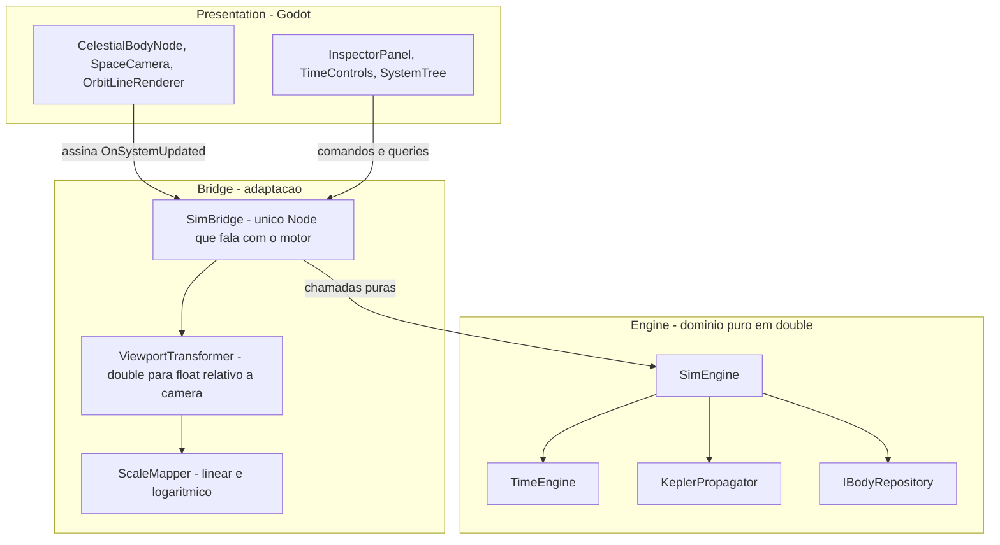
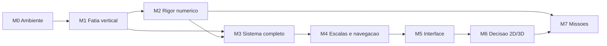

# Roadmap — Solar Sim (Godot + C#)

Plano de execução derivado da especificação de engenharia: solução analítica de Kepler
para o problema de dois corpos, sobre uma arquitetura em camadas com inversão de
dependência.

**Objetivo do produto:** não é um simulador fechado, e sim uma base sobre a qual construir
algo maior depois (missões espaciais, transferências orbitais). Isso muda o projeto do
motor: capacidades que num simulador puramente visual seriam luxo — vetor de estado,
conversão inversa de órbita, cônicas abertas — aqui são fundação.

**Estratégia:** fatia vertical primeiro. O marco M1 atravessa todas as camadas de forma
rasa e coloca a Terra girando na tela antes de qualquer camada estar completa. Só depois
cada camada é aprofundada. Isso valida a arquitetura cedo, quando corrigir ainda é barato.

**Legenda de status:** `[ ]` pendente · `[~]` em andamento · `[x]` concluído

---

## Invariantes arquiteturais

Estas quatro regras valem para todo o projeto e estão espelhadas em `.cursor/rules/`.
Violá-las não gera um bug imediato e visível — gera erosão silenciosa que só aparece
muitos marcos depois, quando o conserto já é caro.

1. **Nenhum arquivo em `Engine/` contém `using Godot`.** O motor deve compilar e ser
   testado sem o Godot sequer instalado. Essa é a definição operacional de domínio puro.
2. **Toda matemática do domínio em `double`.** A conversão para `float` acontece somente
   na camada Bridge, e somente *depois* de subtrair a posição da câmera. Converter antes
   é exatamente o que produz trepidação em objetos distantes da origem.
3. **Unidades internas: quilômetros, segundos, radianos.** Graus existem apenas na
   fronteira do JSON e no texto exibido ao usuário.
4. **O estado é função pura da Data Juliana.** Nada de integração acumulativa. É essa
   propriedade que entrega de graça o tempo reverso, o salto para uma data arbitrária e o
   save/load trivial: salvar o mundo inteiro é salvar um `double`.

### Convenção de unidades

| Grandeza | Unidade | Observação |
| --- | --- | --- |
| Distância | km | |
| Tempo (física) | segundos | |
| Tempo (calendário) | Data Juliana em dias | Época J2000.0 = 2451545.0 |
| Ângulos | radianos | Convertidos de graus na carga do JSON |
| Parâmetro gravitacional | km³/s² | Mesma unidade em que o JPL publica GM |

A escolha de km e segundos alinha o projeto com a literatura de astrodinâmica e com as
tabelas do JPL, evitando uma camada de conversão no dia em que as transferências orbitais
entrarem. O custo é converter `Δt` de dias para segundos no propagador, o que é uma
multiplicação por 86400 em um único ponto do código.

---

## Arquitetura em camadas



### Por que a camada Bridge existe

O diagrama da especificação previa uma camada de adaptação, mas a estrutura inicial de
pastas tinha apenas `Engine/`, `Render/` e `UI/`. Sem um lugar próprio, duas
responsabilidades escorregam para dentro de `Render/`:

- a conversão `double` para `float` relativa à câmera, que é o único ponto onde a precisão
  do sistema pode ser destruída;
- o mapeamento de escala linear e logarítmico.

Espalhadas por vários nós gráficos, essas duas regras acabam duplicadas e divergentes, e
a fronteira arquitetural vira apenas um comentário no README. Concentradas em `Bridge/`,
existem em um lugar só e podem ser testadas isoladamente.

`SimBridge` é o único nó do Godot que conhece o `SimEngine`. Todos os demais nós assinam
o evento de snapshot. Isso mantém o número de pontos de acoplamento entre os dois mundos
igual a um.

---

## Estado do ambiente

Instalado e verificado: **.NET SDK 10.0.302** e **Godot 4.7.1 (variante .NET)**. A solução
compila sem avisos e os testes rodam com o editor fechado.

Os projetos alvejam `net8.0` (motor e projeto Godot) e `net10.0` (testes). O Godot 4.7
exige no mínimo .NET 8, e a recomendação oficial é manter o SDK mais recente instalado
independentemente do alvo.

---

## M0 — Ambiente e esqueleto compilável

Objetivo: sair do zero absoluto para um projeto que compila, abre no Godot e roda testes.

- [x] .NET SDK 10.0.302 instalado e verificado com `dotnet --info`
- [x] Godot 4.7.1 na variante .NET (o pacote se chama `GodotEngine.GodotEngine.Mono`;
      o nome "Mono" é histórico e não indica o runtime antigo)
- [x] `solar-sim-godot.csproj` com `Godot.NET.Sdk/4.7.1`, `EnableDynamicLoading` e
      `Nullable`, excluindo `Engine/**` e `Tests/**` dos globs de compilação
- [x] `project.godot` com `config_version=5` e cena principal apontando para `Main.tscn`
- [x] Cenas mínimas válidas em `Scenes/`, sem as quais o projeto não abre
- [x] `Engine/SolarSim.Engine.csproj` como biblioteca separada
- [x] `Tests/SolarSim.Tests.csproj` (xUnit) referenciando apenas `Engine/`
- [x] `solar-sim-godot.sln` no formato clássico, agregando os três projetos
- [x] Teste-guardião do invariante 1 em `Tests/ArchitectureTests.cs`
- [x] `.gdignore` em `Engine/` e `Tests/`, para o Godot não tratá-los como pastas de script
- [x] Regras do projeto em `.cursor/rules/`, `AGENTS.md`, `.gitignore`, `.gitattributes`,
      `.editorconfig` e `README.md`

### Decisão: o motor é um projeto separado

Em vez de deixar `Engine/` dentro do projeto do Godot e confiar em disciplina, ele virou
uma biblioteca própria que não referencia o `GodotSharp`. O projeto do Godot e os testes
dependem dela por `ProjectReference`.

Com isso, o invariante 1 deixa de ser convenção e passa a ser garantido pelo compilador:
escrever `using Godot` em `Engine/` simplesmente não compila. O teste-guardião continua
existindo para pegar o caso em que alguém adiciona a referência ao `.csproj` do motor.

**Pronto quando:** ~~`dotnet build` passa, o Godot abre o projeto sem erro, e um teste
trivial roda com o editor fechado.~~ **Concluído:** build sem avisos, dois testes
passando, e `--headless --import` seguido de execução da cena principal com código de
saída 0.

---

## M1 — Fatia vertical: a Terra na tela

O marco mais importante do roadmap. Objetivo: o caminho mais curto que toca **todas** as
camadas, provando que a arquitetura funciona de ponta a ponta antes de investir em
profundidade. Tudo aqui é intencionalmente mínimo.

Corte mínimo por camada:

- [ ] `Engine/Core/AstroConstants.cs` — J2000, GM do Sol, segundos por dia
- [ ] `Engine/Models/Vector3D.cs` — soma, subtração, escala, magnitude. Só isso
- [ ] `Engine/Models/OrbitalElements.cs` — os seis elementos, sem validação sofisticada
- [ ] `Engine/Core/TimeEngine.cs` — UTC para JD, acúmulo por delta e multiplicador,
      pausa. Sem conversão inversa ainda
- [ ] `Engine/Core/KeplerPropagator.cs` — apenas o caso elíptico, Newton-Raphson simples
- [ ] `Engine/Data/IBodyRepository.cs` + `HardcodedBodyRepository` com Sol e Terra
- [ ] `Engine/SimEngine.cs` — lista plana (sem hierarquia), snapshot e evento
- [ ] `Bridge/ScaleMapper.cs` — só o modo linear
- [ ] `Bridge/ViewportTransformer.cs` — subtração da câmera em `double`, conversão a `float`
- [ ] `Bridge/SimBridge.cs` — `_Process` avança o tempo e dispara o snapshot
- [ ] `Render/CelestialBodyNode.cs` e `Render/SpaceCamera.cs` — andaime 2D, câmera fixa
- [ ] `Scenes/Main.tscn` e `Scenes/Prefabs/CelestialBody.tscn`
- [ ] Um botão de play/pause improvisado

O repositório entra como interface já no M1, com implementação hardcoded, justamente para
adiar a discussão de schema do JSON até o M3 sem criar dívida: quando o
`JsonBodyRepository` chegar, ele entra pela mesma porta e nada acima precisa mudar.

**Pronto quando:** a Terra descreve uma volta completa em torno do Sol na tela, com
play/pause funcionando e velocidade temporal ajustável no código.

---

## M2 — Rigor numérico

Objetivo: transformar "parece certo" em "está comprovadamente certo". A partir daqui o
motor é confiável o suficiente para construir em cima.

- [ ] Newton-Raphson com tolerância `1e-12`, teto de iterações e chute inicial adaptado
      para excentricidade alta (`E₀ = π` quando `e > 0.8`)
- [ ] Normalizar a anomalia média para `[0, 2π)` antes de resolver
- [ ] Anomalia verdadeira por `atan2`, **não** pela fórmula `tan(ν/2)` da especificação:
      a versão com tangente perde precisão perto de `E = π`, ou seja, justamente na
      metade da órbita próxima ao afélio
- [ ] Vetor velocidade, necessário para o painel de inspeção e para tudo no M7
- [ ] Rotação completa `Rz(-Ω)·Rx(-i)·Rz(-ω)` com as três componentes
- [ ] Testes: round-trip de tempo, conservação de energia orbital, convergência do
      solver para toda faixa de excentricidade, e comparação contra o JPL Horizons

**Pronto quando:** posições de Terra e Marte conferem com o JPL Horizons em três datas
distintas, com erro relativo abaixo de 0,1% na distância radial, e o solver converge em
menos de dez iterações para todo `e < 0.95`.

---

## M3 — Sistema completo e hierarquia

Objetivo: sair de dois corpos hardcoded para o Sistema Solar real, com luas.

- [ ] Definir o schema de `Data/solar_system_j2000.json`, com unidades explícitas no
      próprio arquivo
- [ ] Popular Sol, oito planetas, Lua, galileanas e Titã
- [ ] `Engine/Data/DataLoader.cs` e `JsonBodyRepository` implementando `IBodyRepository`,
      convertendo graus para radianos na carga
- [ ] Validação na carga: corpo pai inexistente, ciclo na hierarquia, `a <= 0`, campos
      ausentes — com mensagem de erro que diga qual corpo e qual campo
- [ ] Ordem de avaliação garantindo pai antes de filho
- [ ] Composição recursiva `P_global(A) = P_global(Pai(A)) + P_local(A)`
- [ ] Remover a implementação hardcoded

**Pronto quando:** a distância Terra–Lua permanece dentro da faixa real (363.000 a 406.000
km) ao longo de um século simulado. Esse teste é o que prova que a composição hierárquica
não acumula erro.

---

## M4 — Escalas e navegação

Objetivo: tornar o Sistema Solar navegável, que é o problema visual central — em escala
real, os planetas são invisíveis.

- [ ] Modo logarítmico perceptual:
      `r_vis = ln(1 + α·r) / ln(1 + α·r_max) · R_tela`
- [ ] Escala independente para o raio dos corpos, desacoplada da escala de distância
- [ ] Transição suave entre os modos linear e logarítmico
- [ ] `Render/SpaceCamera.cs` completo: zoom exponencial, pan, ancoragem em um corpo,
      transição suave ao trocar de alvo
- [ ] `Render/OrbitLineRenderer.cs`: amostragem de um período completo via propagador,
      com cache invalidado apenas por mudança de escala ou de câmera

**Pronto quando:** com a câmera ancorada em Netuno, não há trepidação visual em nenhum
nível de zoom, e o Sistema Solar completo com órbitas se mantém acima de 60 fps.

---

## M5 — Interface

- [ ] `UI/TimeControls.cs` — play/pause, multiplicador (1x, 1000x, 100000x), data legível,
      entrada de data arbitrária, retorno a J2000, tempo reverso
- [ ] `UI/SystemTree.cs` — árvore hierárquica navegável; selecionar ancora a câmera
- [ ] `UI/InspectorPanel.cs` — elementos orbitais, distância ao pai e ao Sol, velocidade
      instantânea, período, dados físicos

**Pronto quando:** todo dado exibido vem do snapshot ou de consulta ao motor. Nenhum
componente de UI mantém cópia própria de estado da simulação.

---

## M6 — Ponto de decisão 2D/3D

Marco de reavaliação explícito, não de implementação. Até aqui, `Render/` é um andaime 2D
declaradamente descartável.

O custo de migrar para 3D está limitado a quatro arquivos:

- `Render/CelestialBodyNode.cs`
- `Render/SpaceCamera.cs`
- `Render/OrbitLineRenderer.cs`
- os arquivos `.tscn`

`Engine/` e `Bridge/` não mudam, porque ambos sempre trabalharam com `Vector3D` completo:
o andaime 2D apenas ignora a componente Z. É por isso que a decisão pode esperar até aqui
sem custo de retrabalho no que importa.

- [ ] Decidir entre manter 2D ou migrar para Node3D, agora com o sistema real em mãos
- [ ] Se migrar: câmera orbital em três eixos, iluminação, profundidade
- [ ] Se manter: aproveitar o orçamento em qualidade visual 2D

**Pronto quando:** a decisão está tomada e registrada neste documento com a justificativa.

---

## M7 — Fundações para missões

Objetivo: as capacidades que transformam o simulador em base para transferências orbitais
e missões. Estão aqui, e não no backlog, porque algumas delas influenciam o desenho das
estruturas desde o M1.

- [ ] `Engine/Models/StateVector.cs` — posição e velocidade como tipo de primeira classe
- [ ] Conversão `OrbitalElements` para `StateVector` (já implícita no propagador)
- [ ] Conversão inversa `StateVector` para `OrbitalElements` — o problema inverso, que é o
      que permite criar um corpo a partir de posição e velocidade arbitrárias, e portanto
      o que permite existir uma nave
- [ ] Órbitas com `e >= 1`: hiperbólicas e parabólicas. Toda transferência e todo sobrevoo
      passam por trajetórias abertas, então isso deixa de ser caso exótico
- [ ] Avaliar a formulação por variáveis universais, que trata todas as cônicas com um
      único solver, em lugar de ramificar por tipo de órbita
- [ ] Registro dinâmico de corpos em runtime, com adição e remoção fora do JSON
- [ ] Esfera de influência e reatribuição de corpo pai (cônicas emendadas)
- [ ] Save/load, que graças ao invariante 4 é serializar `JD` mais os corpos dinâmicos

**Pronto quando:** é possível inserir um corpo em runtime a partir de um vetor de estado
arbitrário, e ele é propagado corretamente junto com o resto do sistema.

---

## Estrutura de arquivos alvo

```
solar-sim-godot/
├── .cursor/
│   └── rules/                       # convenções por camada, com exemplos
├── Data/
│   └── solar_system_j2000.json
├── Engine/                          # DOMÍNIO PURO (projeto próprio, zero Godot)
│   ├── SolarSim.Engine.csproj
│   ├── .gdignore
│   ├── Core/
│   │   ├── AstroConstants.cs        # novo — constantes e unidades
│   │   ├── TimeEngine.cs
│   │   └── KeplerPropagator.cs
│   ├── Models/
│   │   ├── CelestialBodyData.cs
│   │   ├── OrbitalElements.cs
│   │   ├── StateVector.cs           # novo — posição + velocidade (M7)
│   │   └── Vector3D.cs
│   ├── Data/
│   │   ├── IBodyRepository.cs       # novo — inversão de dependência
│   │   └── DataLoader.cs
│   └── SimEngine.cs
├── Bridge/                          # novo — CAMADA DE ADAPTAÇÃO
│   ├── SimBridge.cs
│   ├── ViewportTransformer.cs
│   └── ScaleMapper.cs
├── Render/                          # andaime 2D até o M6
│   ├── CelestialBodyNode.cs
│   ├── OrbitLineRenderer.cs
│   └── SpaceCamera.cs
├── UI/
│   ├── InspectorPanel.cs
│   ├── TimeControls.cs
│   └── SystemTree.cs
├── Scenes/
│   ├── Main.tscn
│   └── Prefabs/
│       └── CelestialBody.tscn
├── Tests/                           # referencia apenas Engine/
│   ├── SolarSim.Tests.csproj
│   ├── ArchitectureTests.cs         # guardião do invariante 1
│   └── .gdignore
├── project.godot
├── solar-sim-godot.sln
├── .editorconfig
├── .gitattributes
├── .gitignore
├── AGENTS.md
├── README.md
├── ROADMAP.md
└── solar-sim-godot.csproj
```

---

## Backlog

Fora do escopo dos oito marcos, em ordem aproximada de valor:

- Elementos orbitais variáveis no tempo (taxas seculares), que melhoram bastante a
  precisão de longo prazo por um custo baixo
- Perturbações gravitacionais de terceiro corpo
- Precisão de nível VSOP87 ou DE440
- Integração numérica de N-corpos como modo alternativo ao analítico
- Asteroides e cometas
- Rotação axial, obliquidade e fases de iluminação
- Janelas de transferência e planejamento de manobras

---

## Ordem de dependência



M2 e M3 podem avançar em paralelo depois do M1, desde que o M3 não seja dado como pronto
antes do M2 — validar hierarquia sobre um propagador não verificado apenas mascara de
qual das duas camadas veio o erro.

M7 depende tecnicamente só do M2, mas fazê-lo antes do M6 significa escrever código de
missão contra uma camada de renderização que ainda pode mudar.
